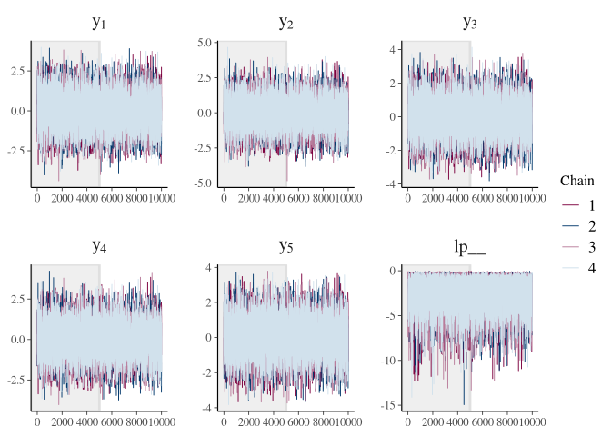
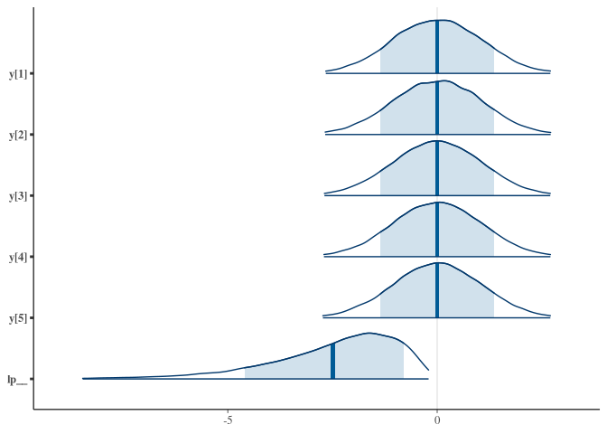
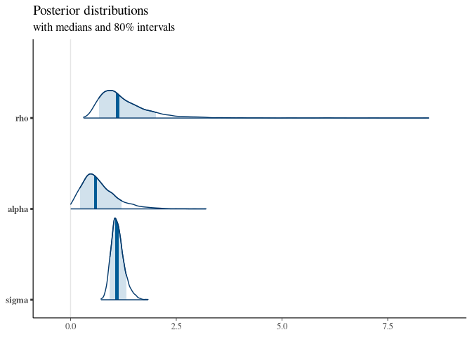

gaussian processes
================
FZ
3/18/2021

## Libraries

``` r
library(tidyverse)
```

    ## ── Attaching packages ─────────────────────────────────────── tidyverse 1.3.0 ──

    ## ✓ ggplot2 3.3.3     ✓ purrr   0.3.4
    ## ✓ tibble  3.0.6     ✓ dplyr   1.0.4
    ## ✓ tidyr   1.1.2     ✓ stringr 1.4.0
    ## ✓ readr   1.4.0     ✓ forcats 0.5.1

    ## ── Conflicts ────────────────────────────────────────── tidyverse_conflicts() ──
    ## x dplyr::filter() masks stats::filter()
    ## x dplyr::lag()    masks stats::lag()

``` r
library(rstan)
```

    ## Loading required package: StanHeaders

    ## rstan (Version 2.21.2, GitRev: 2e1f913d3ca3)

    ## For execution on a local, multicore CPU with excess RAM we recommend calling
    ## options(mc.cores = parallel::detectCores()).
    ## To avoid recompilation of unchanged Stan programs, we recommend calling
    ## rstan_options(auto_write = TRUE)

    ## 
    ## Attaching package: 'rstan'

    ## The following object is masked from 'package:tidyr':
    ## 
    ##     extract

``` r
library(bayesplot)
```

    ## This is bayesplot version 1.8.0

    ## - Online documentation and vignettes at mc-stan.org/bayesplot

    ## - bayesplot theme set to bayesplot::theme_default()

    ##    * Does _not_ affect other ggplot2 plots

    ##    * See ?bayesplot_theme_set for details on theme setting

``` r
options(mc.cores = parallel::detectCores())
```

## GP over N points:

``` stan
data {
  int<lower=1> N;
  real x[N];
}

transformed data {
  matrix[N, N] K;
  vector[N] mu = rep_vector(0, N);
  for (i in 1:(N - 1)) {
    K[i, i] = 1 + 0.1;
    for (j in (i + 1):N) {
      K[i, j] = exp(-0.5 * square(x[i] - x[j])/10);
      K[j, i] = K[i, j];
    }
  }
  K[N, N] = 1 + 0.1;
}
parameters {
  vector[N] y;
}
model {
  y ~ multi_normal(mu, K);
}
  
```

## Fitting the model:

``` r
N <- 5
gp_data <- list(N = N, x = seq(0, 2, length.out = N))
gp_data
```

    ## $N
    ## [1] 5
    ## 
    ## $x
    ## [1] 0.0 0.5 1.0 1.5 2.0

``` r
fit <- sampling(object = gp1, data = gp_data, 
                iter = 10000, control = list(max_treedepth = 20))
```

``` r
fit
```

    ## Inference for Stan model: 4edecfd733539a501216d249c20a7052.
    ## 4 chains, each with iter=10000; warmup=5000; thin=1; 
    ## post-warmup draws per chain=5000, total post-warmup draws=20000.
    ## 
    ##       mean se_mean   sd  2.5%   25%   50%   75% 97.5% n_eff Rhat
    ## y[1]  0.00    0.02 1.06 -2.07 -0.74  0.00  0.73  2.04  3835    1
    ## y[2]  0.00    0.02 1.06 -2.10 -0.73  0.01  0.72  2.07  3504    1
    ## y[3] -0.01    0.02 1.06 -2.08 -0.73  0.00  0.71  2.08  3433    1
    ## y[4]  0.00    0.02 1.06 -2.09 -0.72  0.00  0.71  2.09  3478    1
    ## y[5]  0.00    0.02 1.07 -2.09 -0.72  0.00  0.71  2.07  3607    1
    ## lp__ -2.49    0.02 1.57 -6.42 -3.30 -2.16 -1.33 -0.44  6675    1
    ## 
    ## Samples were drawn using NUTS(diag_e) at Fri Mar 26 13:25:35 2021.
    ## For each parameter, n_eff is a crude measure of effective sample size,
    ## and Rhat is the potential scale reduction factor on split chains (at 
    ## convergence, Rhat=1).

### Posterior Samples from a GP:

``` r
y_x <- extract(fit, inc_warmup = TRUE, permuted = FALSE)


color_scheme_set("mix-blue-pink")
p <- 
  mcmc_trace(y_x,  
             n_warmup = 5000,
             facet_args = list(nrow = 2, labeller = label_parsed))

p + facet_text(size = 15)
```

<!-- -->

``` r
mcmc_areas(
  y_x, 
  prob = 0.8, # 80% intervals
  prob_outer = 0.99, # 99%
  point_est = "mean"
)
```

<!-- -->

## Fitting a GP:

1- Estimate the params \| data. 2- Plug-in the params and predict.

``` stan
data {
  int<lower=1> N;
  real x[N];
  vector[N] y;
}

transformed data {
  vector[N] mu = rep_vector(0, N);
}

parameters {
  real<lower=0> rho;
  real<lower=0> alpha;
  real<lower=0> sigma;
}

model {
  matrix[N, N] L_K;
  matrix[N, N] K = cov_exp_quad(x, alpha, rho);
  real sq_sigma = square(sigma);

  // diagonal elements
  for (n in 1:N)
    K[n, n] = K[n, n] + sq_sigma;

  L_K = cholesky_decompose(K);

  rho ~ inv_gamma(5, 5);
  alpha ~ std_normal();
  sigma ~ std_normal();

  y ~ multi_normal_cholesky(mu, L_K);
}
```

## Estimating the parameters:

``` r
N <- 30
x <- seq(0, 2, length.out = N)
y <- sin(x) + rnorm(N, 0, 1)

gp_params_data <- list(N = N, x = x, y = y)
gp_params_data
```

    ## $N
    ## [1] 30
    ## 
    ## $x
    ##  [1] 0.00000000 0.06896552 0.13793103 0.20689655 0.27586207 0.34482759
    ##  [7] 0.41379310 0.48275862 0.55172414 0.62068966 0.68965517 0.75862069
    ## [13] 0.82758621 0.89655172 0.96551724 1.03448276 1.10344828 1.17241379
    ## [19] 1.24137931 1.31034483 1.37931034 1.44827586 1.51724138 1.58620690
    ## [25] 1.65517241 1.72413793 1.79310345 1.86206897 1.93103448 2.00000000
    ## 
    ## $y
    ##  [1] -0.68421041  0.98457196  0.10778694  0.67746249  0.13794826  0.26646183
    ##  [7] -0.45863935 -0.74355492 -2.09385593  2.51747277 -1.00874092 -0.99539898
    ## [13]  0.97144581  1.27404138  2.15227771  0.12688995 -1.01177664  2.09803553
    ## [19] -0.07064151  2.20541235  1.51156249  0.68419999 -0.23770242  0.43266929
    ## [25]  0.60584363  0.34343512  1.45427508  0.55456871  1.88587346  0.32728252

``` r
fit_params = sampling(object = gp_params, data = gp_params_data)
```

``` r
fit_params
```

    ## Inference for Stan model: 8ca67fd9ca46924c00e121924f3206a1.
    ## 4 chains, each with iter=2000; warmup=1000; thin=1; 
    ## post-warmup draws per chain=1000, total post-warmup draws=4000.
    ## 
    ##         mean se_mean   sd   2.5%    25%    50%    75%  97.5% n_eff Rhat
    ## rho     1.27    0.01 0.66   0.53   0.84   1.11   1.52   2.91  2474 1.00
    ## alpha   0.67    0.01 0.41   0.09   0.38   0.59   0.88   1.68  3716 1.00
    ## sigma   1.12    0.00 0.16   0.86   1.01   1.10   1.20   1.47  2888 1.00
    ## lp__  -26.58    0.04 1.36 -30.31 -27.20 -26.23 -25.59 -25.07  1240 1.01
    ## 
    ## Samples were drawn using NUTS(diag_e) at Fri Mar 26 13:26:13 2021.
    ## For each parameter, n_eff is a crude measure of effective sample size,
    ## and Rhat is the potential scale reduction factor on split chains (at 
    ## convergence, Rhat=1).

``` r
param_posteriors <- extract(fit_params, inc_warmup = TRUE, permuted = FALSE)

color_scheme_set("mix-blue-pink")
p <- mcmc_trace(param_posteriors,  pars = c("rho", "alpha", "sigma"), n_warmup = 300,
                facet_args = list(nrow = 2, labeller = label_parsed))
p + facet_text(size = 15)
```

<!-- -->

``` r
mcmc_areas(fit_params, regex_pars = c("rho", "alpha", "sigma"),  prob = 0.8) +
 labs(
   title = "Posterior distributions",
   subtitle = "with medians and 80% intervals"
 )
```

<!-- -->

#### Posterior distribution:

``` r
posterior_summary <-
  as.tibble(extract(fit_params)) %>%
  select(-lp__) %>%
  pivot_longer(cols = c("rho", "alpha", "sigma"), 
               names_to = "param", values_to = "mcmc_estimate") %>%
  group_by(param) %>%
  summarise(mean_p = mean(mcmc_estimate), sd_p = sd(mcmc_estimate))
```

    ## Warning: `as.tibble()` was deprecated in tibble 2.0.0.
    ## Please use `as_tibble()` instead.
    ## The signature and semantics have changed, see `?as_tibble`.

``` r
fit_params
```

    ## Inference for Stan model: 8ca67fd9ca46924c00e121924f3206a1.
    ## 4 chains, each with iter=2000; warmup=1000; thin=1; 
    ## post-warmup draws per chain=1000, total post-warmup draws=4000.
    ## 
    ##         mean se_mean   sd   2.5%    25%    50%    75%  97.5% n_eff Rhat
    ## rho     1.27    0.01 0.66   0.53   0.84   1.11   1.52   2.91  2474 1.00
    ## alpha   0.67    0.01 0.41   0.09   0.38   0.59   0.88   1.68  3716 1.00
    ## sigma   1.12    0.00 0.16   0.86   1.01   1.10   1.20   1.47  2888 1.00
    ## lp__  -26.58    0.04 1.36 -30.31 -27.20 -26.23 -25.59 -25.07  1240 1.01
    ## 
    ## Samples were drawn using NUTS(diag_e) at Fri Mar 26 13:26:13 2021.
    ## For each parameter, n_eff is a crude measure of effective sample size,
    ## and Rhat is the potential scale reduction factor on split chains (at 
    ## convergence, Rhat=1).

## Predictive model:

-   add generated quantities at the end.

-   most of the post pred density is computed using functions.

``` stan
functions {

  matrix KxX_IKXX(int N1, int N2, real[] x1, real[] x2, real alpha, real rho){
  
    matrix[N2, N2] Kx2x2 = cov_exp_quad(x2, alpha, rho);
    
    matrix[N1, N2] Kx1x2;
    
    for(r in 1:N1){
      for(c in 1:N2){
        Kx1x2[r, c] = 
          square(alpha) * exp(- square(x1[r] - x2[c]) / (2 * square(rho)));
      }
    }
    return Kx1x2 * inverse(Kx2x2);
  }
}

data {
  int<lower=1> N;
  real x[N];
  vector[N] y;
  // pred:
  int<lower=1> N_new;
  real x_new[N_new];
}

transformed data {
  vector[N] mu = rep_vector(0, N);
}

parameters {
  real<lower=0> rho;
  real<lower=0> alpha;
  real<lower=0> sigma;
}

model {
  matrix[N, N] L_K;
  matrix[N, N] K = cov_exp_quad(x, alpha, rho);
  real sq_sigma = square(sigma);

  // diagonal elements
  for (n in 1:N)
    K[n, n] = K[n, n] + sq_sigma;

  L_K = cholesky_decompose(K);

  rho ~ inv_gamma(5, 5);
  alpha ~ std_normal();
  sigma ~ std_normal();

  y ~ multi_normal_cholesky(mu, L_K);
}

generated quantities {

  vector[N_new] y_new;
  y_new = KxX_IKXX(N_new, N, x_new, x, alpha, rho) * y;
  
}
```

``` r
N <- 10
x <- seq(0, 2, length.out = N)
y <- sin(x) + runif(N, 0, 0.1)

N_new <- 2
x_new <- c(0.23, 1.23)

gp_pred_data <- list(N = N, x = x, y = y, 
                     N_new = N_new, x_new = x_new)
gp_pred_data
```

    ## $N
    ## [1] 10
    ## 
    ## $x
    ##  [1] 0.0000000 0.2222222 0.4444444 0.6666667 0.8888889 1.1111111 1.3333333
    ##  [8] 1.5555556 1.7777778 2.0000000
    ## 
    ## $y
    ##  [1] 0.00248443 0.28846456 0.50185429 0.62725046 0.86187629 0.92509887
    ##  [7] 1.06846939 1.04680630 1.00385880 0.95272867
    ## 
    ## $N_new
    ## [1] 2
    ## 
    ## $x_new
    ## [1] 0.23 1.23

``` r
fit_pred <- sampling(gp_pred, data = gp_pred_data)
```

``` r
fit_pred
```

    ## Inference for Stan model: ddfde822bb8387a26d5cc001888059d9.
    ## 4 chains, each with iter=2000; warmup=1000; thin=1; 
    ## post-warmup draws per chain=1000, total post-warmup draws=4000.
    ## 
    ##          mean se_mean    sd  2.5%  25%  50%  75% 97.5% n_eff Rhat
    ## rho      1.40    0.01  0.38  0.77 1.13 1.36 1.63  2.29  2128    1
    ## alpha    0.93    0.01  0.40  0.42 0.64 0.84 1.12  1.92  1909    1
    ## sigma    0.05    0.00  0.02  0.02 0.03 0.04 0.06  0.10  1853    1
    ## y_new[1] 0.47    0.18 11.12 -0.21 0.31 0.31 0.31  0.89  4004    1
    ## y_new[2] 0.81    0.12  7.43  0.42 0.99 0.99 0.99  1.50  4009    1
    ## lp__     7.50    0.03  1.30  4.25 6.92 7.83 8.46  8.96  1533    1
    ## 
    ## Samples were drawn using NUTS(diag_e) at Fri Mar 26 13:26:44 2021.
    ## For each parameter, n_eff is a crude measure of effective sample size,
    ## and Rhat is the potential scale reduction factor on split chains (at 
    ## convergence, Rhat=1).
