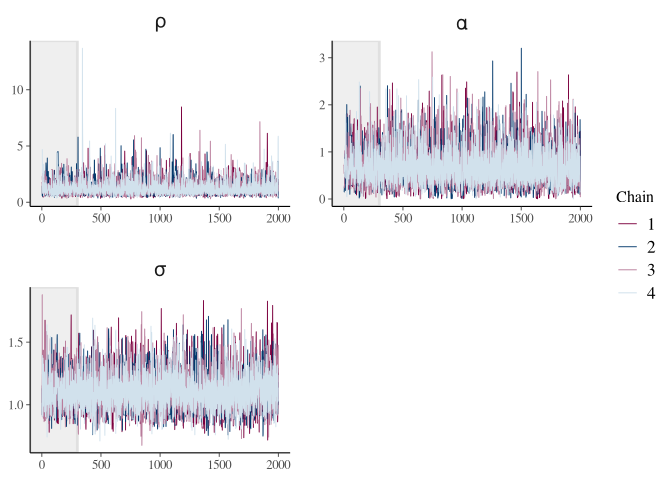

gaussian processes
================
FZ
3/18/2021

## Libraries

``` r
library(tidyverse)
```

    ## ── Attaching packages ─────────────────────────────────────── tidyverse 1.3.0 ──

    ## ✓ ggplot2 3.3.3     ✓ purrr   0.3.4
    ## ✓ tibble  3.0.6     ✓ dplyr   1.0.4
    ## ✓ tidyr   1.1.2     ✓ stringr 1.4.0
    ## ✓ readr   1.4.0     ✓ forcats 0.5.1

    ## ── Conflicts ────────────────────────────────────────── tidyverse_conflicts() ──
    ## x dplyr::filter() masks stats::filter()
    ## x dplyr::lag()    masks stats::lag()

``` r
library(rstan)
```

    ## Loading required package: StanHeaders

    ## rstan (Version 2.21.2, GitRev: 2e1f913d3ca3)

    ## For execution on a local, multicore CPU with excess RAM we recommend calling
    ## options(mc.cores = parallel::detectCores()).
    ## To avoid recompilation of unchanged Stan programs, we recommend calling
    ## rstan_options(auto_write = TRUE)

    ## 
    ## Attaching package: 'rstan'

    ## The following object is masked from 'package:tidyr':
    ## 
    ##     extract

``` r
library(rstanarm)
```

    ## Loading required package: Rcpp

    ## This is rstanarm version 2.21.1

    ## - See https://mc-stan.org/rstanarm/articles/priors for changes to default priors!

    ## - Default priors may change, so it's safest to specify priors, even if equivalent to the defaults.

    ## - For execution on a local, multicore CPU with excess RAM we recommend calling

    ##   options(mc.cores = parallel::detectCores())

    ## 
    ## Attaching package: 'rstanarm'

    ## The following object is masked from 'package:rstan':
    ## 
    ##     loo

``` r
library(bayesplot)
```

    ## This is bayesplot version 1.8.0

    ## - Online documentation and vignettes at mc-stan.org/bayesplot

    ## - bayesplot theme set to bayesplot::theme_default()

    ##    * Does _not_ affect other ggplot2 plots

    ##    * See ?bayesplot_theme_set for details on theme setting

## GP over 5 points:

``` stan
data {
  int<lower=1> N;
  real x[N];
}

transformed data {
  matrix[N, N] K;
  vector[N] mu = rep_vector(0, N);
  for (i in 1:(N - 1)) {
    K[i, i] = 1 + 0.1;
    for (j in (i + 1):N) {
      K[i, j] = exp(-0.5 * square(x[i] - x[j]));
      K[j, i] = K[i, j];
    }
  }
  K[N, N] = 1 + 0.1;
}
parameters {
  vector[N] y;
}
model {
  y ~ multi_normal(mu, K);
}
  
```

## Fitting the model:

``` r
gp_data <- list(N = 10, x = seq(1, 10))
gp_data
```

    ## $N
    ## [1] 10
    ## 
    ## $x
    ##  [1]  1  2  3  4  5  6  7  8  9 10

``` r
fit = sampling(object = gp1, data = gp_data)
```

    ## 
    ## SAMPLING FOR MODEL '2b5d01b12e63cfef128b895396667d8f' NOW (CHAIN 1).
    ## Chain 1: 
    ## Chain 1: Gradient evaluation took 2.1e-05 seconds
    ## Chain 1: 1000 transitions using 10 leapfrog steps per transition would take 0.21 seconds.
    ## Chain 1: Adjust your expectations accordingly!
    ## Chain 1: 
    ## Chain 1: 
    ## Chain 1: Iteration:    1 / 2000 [  0%]  (Warmup)
    ## Chain 1: Iteration:  200 / 2000 [ 10%]  (Warmup)
    ## Chain 1: Iteration:  400 / 2000 [ 20%]  (Warmup)
    ## Chain 1: Iteration:  600 / 2000 [ 30%]  (Warmup)
    ## Chain 1: Iteration:  800 / 2000 [ 40%]  (Warmup)
    ## Chain 1: Iteration: 1000 / 2000 [ 50%]  (Warmup)
    ## Chain 1: Iteration: 1001 / 2000 [ 50%]  (Sampling)
    ## Chain 1: Iteration: 1200 / 2000 [ 60%]  (Sampling)
    ## Chain 1: Iteration: 1400 / 2000 [ 70%]  (Sampling)
    ## Chain 1: Iteration: 1600 / 2000 [ 80%]  (Sampling)
    ## Chain 1: Iteration: 1800 / 2000 [ 90%]  (Sampling)
    ## Chain 1: Iteration: 2000 / 2000 [100%]  (Sampling)
    ## Chain 1: 
    ## Chain 1:  Elapsed Time: 0.04972 seconds (Warm-up)
    ## Chain 1:                0.049804 seconds (Sampling)
    ## Chain 1:                0.099524 seconds (Total)
    ## Chain 1: 
    ## 
    ## SAMPLING FOR MODEL '2b5d01b12e63cfef128b895396667d8f' NOW (CHAIN 2).
    ## Chain 2: 
    ## Chain 2: Gradient evaluation took 1.5e-05 seconds
    ## Chain 2: 1000 transitions using 10 leapfrog steps per transition would take 0.15 seconds.
    ## Chain 2: Adjust your expectations accordingly!
    ## Chain 2: 
    ## Chain 2: 
    ## Chain 2: Iteration:    1 / 2000 [  0%]  (Warmup)
    ## Chain 2: Iteration:  200 / 2000 [ 10%]  (Warmup)
    ## Chain 2: Iteration:  400 / 2000 [ 20%]  (Warmup)
    ## Chain 2: Iteration:  600 / 2000 [ 30%]  (Warmup)
    ## Chain 2: Iteration:  800 / 2000 [ 40%]  (Warmup)
    ## Chain 2: Iteration: 1000 / 2000 [ 50%]  (Warmup)
    ## Chain 2: Iteration: 1001 / 2000 [ 50%]  (Sampling)
    ## Chain 2: Iteration: 1200 / 2000 [ 60%]  (Sampling)
    ## Chain 2: Iteration: 1400 / 2000 [ 70%]  (Sampling)
    ## Chain 2: Iteration: 1600 / 2000 [ 80%]  (Sampling)
    ## Chain 2: Iteration: 1800 / 2000 [ 90%]  (Sampling)
    ## Chain 2: Iteration: 2000 / 2000 [100%]  (Sampling)
    ## Chain 2: 
    ## Chain 2:  Elapsed Time: 0.050276 seconds (Warm-up)
    ## Chain 2:                0.051212 seconds (Sampling)
    ## Chain 2:                0.101488 seconds (Total)
    ## Chain 2: 
    ## 
    ## SAMPLING FOR MODEL '2b5d01b12e63cfef128b895396667d8f' NOW (CHAIN 3).
    ## Chain 3: 
    ## Chain 3: Gradient evaluation took 1.3e-05 seconds
    ## Chain 3: 1000 transitions using 10 leapfrog steps per transition would take 0.13 seconds.
    ## Chain 3: Adjust your expectations accordingly!
    ## Chain 3: 
    ## Chain 3: 
    ## Chain 3: Iteration:    1 / 2000 [  0%]  (Warmup)
    ## Chain 3: Iteration:  200 / 2000 [ 10%]  (Warmup)
    ## Chain 3: Iteration:  400 / 2000 [ 20%]  (Warmup)
    ## Chain 3: Iteration:  600 / 2000 [ 30%]  (Warmup)
    ## Chain 3: Iteration:  800 / 2000 [ 40%]  (Warmup)
    ## Chain 3: Iteration: 1000 / 2000 [ 50%]  (Warmup)
    ## Chain 3: Iteration: 1001 / 2000 [ 50%]  (Sampling)
    ## Chain 3: Iteration: 1200 / 2000 [ 60%]  (Sampling)
    ## Chain 3: Iteration: 1400 / 2000 [ 70%]  (Sampling)
    ## Chain 3: Iteration: 1600 / 2000 [ 80%]  (Sampling)
    ## Chain 3: Iteration: 1800 / 2000 [ 90%]  (Sampling)
    ## Chain 3: Iteration: 2000 / 2000 [100%]  (Sampling)
    ## Chain 3: 
    ## Chain 3:  Elapsed Time: 0.049493 seconds (Warm-up)
    ## Chain 3:                0.050183 seconds (Sampling)
    ## Chain 3:                0.099676 seconds (Total)
    ## Chain 3: 
    ## 
    ## SAMPLING FOR MODEL '2b5d01b12e63cfef128b895396667d8f' NOW (CHAIN 4).
    ## Chain 4: 
    ## Chain 4: Gradient evaluation took 8e-06 seconds
    ## Chain 4: 1000 transitions using 10 leapfrog steps per transition would take 0.08 seconds.
    ## Chain 4: Adjust your expectations accordingly!
    ## Chain 4: 
    ## Chain 4: 
    ## Chain 4: Iteration:    1 / 2000 [  0%]  (Warmup)
    ## Chain 4: Iteration:  200 / 2000 [ 10%]  (Warmup)
    ## Chain 4: Iteration:  400 / 2000 [ 20%]  (Warmup)
    ## Chain 4: Iteration:  600 / 2000 [ 30%]  (Warmup)
    ## Chain 4: Iteration:  800 / 2000 [ 40%]  (Warmup)
    ## Chain 4: Iteration: 1000 / 2000 [ 50%]  (Warmup)
    ## Chain 4: Iteration: 1001 / 2000 [ 50%]  (Sampling)
    ## Chain 4: Iteration: 1200 / 2000 [ 60%]  (Sampling)
    ## Chain 4: Iteration: 1400 / 2000 [ 70%]  (Sampling)
    ## Chain 4: Iteration: 1600 / 2000 [ 80%]  (Sampling)
    ## Chain 4: Iteration: 1800 / 2000 [ 90%]  (Sampling)
    ## Chain 4: Iteration: 2000 / 2000 [100%]  (Sampling)
    ## Chain 4: 
    ## Chain 4:  Elapsed Time: 0.050761 seconds (Warm-up)
    ## Chain 4:                0.047908 seconds (Sampling)
    ## Chain 4:                0.098669 seconds (Total)
    ## Chain 4:

### Posterior Samples from a GP:

``` r
posterior <- extract(fit, inc_warmup = FALSE)

n_samples <- dim(posterior$y)[1]

as.tibble(posterior$y) %>%
  mutate(sample_n = 1:n_samples) %>%
  pivot_longer(cols = -sample_n, names_to = "vars", values_to = "mcmc_samples") %>%
  filter(sample_n <= 10) %>%
  mutate(x = rep(1:10, 10), sample_n = factor(sample_n)) %>%
  ggplot(aes(x, mcmc_samples, color = sample_n)) +
  geom_line() +
  labs(title = "10 samples from a GP") +
  theme(legend.position = "none")
```

    ## Warning: `as.tibble()` was deprecated in tibble 2.0.0.
    ## Please use `as_tibble()` instead.
    ## The signature and semantics have changed, see `?as_tibble`.

    ## Warning: The `x` argument of `as_tibble.matrix()` must have unique column names if `.name_repair` is omitted as of tibble 2.0.0.
    ## Using compatibility `.name_repair`.

<!-- -->

## Fitting a GP:

1- Estimate the params \| data. 2- Plug-in the params and predict.

``` stan
data {
  int<lower=1> N;
  real x[N];
  vector[N] y;
}

transformed data {
  vector[N] mu = rep_vector(0, N);
}

parameters {
  real<lower=0> rho;
  real<lower=0> alpha;
  real<lower=0> sigma;
}

model {
  matrix[N, N] L_K;
  matrix[N, N] K = cov_exp_quad(x, alpha, rho);
  real sq_sigma = square(sigma);

  // diagonal elements
  for (n in 1:N)
    K[n, n] = K[n, n] + sq_sigma;

  L_K = cholesky_decompose(K);

  rho ~ inv_gamma(5, 5);
  alpha ~ std_normal();
  sigma ~ std_normal();

  y ~ multi_normal_cholesky(mu, L_K);
}
```

## Estimating the parameters:

``` r
N <- 30
x <- seq(0, 2, length.out = N)
y <- sin(x) + rnorm(N, 0, 1)

gp_params_data <- list(N = N, x = x, y = y)
gp_params_data
```

    ## $N
    ## [1] 30
    ## 
    ## $x
    ##  [1] 0.00000000 0.06896552 0.13793103 0.20689655 0.27586207 0.34482759
    ##  [7] 0.41379310 0.48275862 0.55172414 0.62068966 0.68965517 0.75862069
    ## [13] 0.82758621 0.89655172 0.96551724 1.03448276 1.10344828 1.17241379
    ## [19] 1.24137931 1.31034483 1.37931034 1.44827586 1.51724138 1.58620690
    ## [25] 1.65517241 1.72413793 1.79310345 1.86206897 1.93103448 2.00000000
    ## 
    ## $y
    ##  [1] -0.62960246  1.42480531 -0.61869883 -0.85005068  0.70121757 -1.64422230
    ##  [7]  2.38135651  1.76040492  1.09861064  0.20879557  0.19619398  1.03379337
    ## [13]  2.82390649 -0.33651775  0.99540250  2.60052987  0.95151655  1.84665794
    ## [19]  1.36224128 -0.16794461  1.61216066 -0.13212803 -0.25596182  1.41193794
    ## [25]  1.49274884  0.04233193  1.20839641  1.58861549  1.90757818  1.60855179

``` r
fit_params = sampling(object = gp_params, data = gp_params_data)
```

    ## 
    ## SAMPLING FOR MODEL '8ca67fd9ca46924c00e121924f3206a1' NOW (CHAIN 1).
    ## Chain 1: 
    ## Chain 1: Gradient evaluation took 7.8e-05 seconds
    ## Chain 1: 1000 transitions using 10 leapfrog steps per transition would take 0.78 seconds.
    ## Chain 1: Adjust your expectations accordingly!
    ## Chain 1: 
    ## Chain 1: 
    ## Chain 1: Iteration:    1 / 2000 [  0%]  (Warmup)
    ## Chain 1: Iteration:  200 / 2000 [ 10%]  (Warmup)
    ## Chain 1: Iteration:  400 / 2000 [ 20%]  (Warmup)
    ## Chain 1: Iteration:  600 / 2000 [ 30%]  (Warmup)
    ## Chain 1: Iteration:  800 / 2000 [ 40%]  (Warmup)
    ## Chain 1: Iteration: 1000 / 2000 [ 50%]  (Warmup)
    ## Chain 1: Iteration: 1001 / 2000 [ 50%]  (Sampling)
    ## Chain 1: Iteration: 1200 / 2000 [ 60%]  (Sampling)
    ## Chain 1: Iteration: 1400 / 2000 [ 70%]  (Sampling)
    ## Chain 1: Iteration: 1600 / 2000 [ 80%]  (Sampling)
    ## Chain 1: Iteration: 1800 / 2000 [ 90%]  (Sampling)
    ## Chain 1: Iteration: 2000 / 2000 [100%]  (Sampling)
    ## Chain 1: 
    ## Chain 1:  Elapsed Time: 0.31568 seconds (Warm-up)
    ## Chain 1:                0.320315 seconds (Sampling)
    ## Chain 1:                0.635995 seconds (Total)
    ## Chain 1: 
    ## 
    ## SAMPLING FOR MODEL '8ca67fd9ca46924c00e121924f3206a1' NOW (CHAIN 2).
    ## Chain 2: 
    ## Chain 2: Gradient evaluation took 6.3e-05 seconds
    ## Chain 2: 1000 transitions using 10 leapfrog steps per transition would take 0.63 seconds.
    ## Chain 2: Adjust your expectations accordingly!
    ## Chain 2: 
    ## Chain 2: 
    ## Chain 2: Iteration:    1 / 2000 [  0%]  (Warmup)
    ## Chain 2: Iteration:  200 / 2000 [ 10%]  (Warmup)
    ## Chain 2: Iteration:  400 / 2000 [ 20%]  (Warmup)
    ## Chain 2: Iteration:  600 / 2000 [ 30%]  (Warmup)
    ## Chain 2: Iteration:  800 / 2000 [ 40%]  (Warmup)
    ## Chain 2: Iteration: 1000 / 2000 [ 50%]  (Warmup)
    ## Chain 2: Iteration: 1001 / 2000 [ 50%]  (Sampling)
    ## Chain 2: Iteration: 1200 / 2000 [ 60%]  (Sampling)
    ## Chain 2: Iteration: 1400 / 2000 [ 70%]  (Sampling)
    ## Chain 2: Iteration: 1600 / 2000 [ 80%]  (Sampling)
    ## Chain 2: Iteration: 1800 / 2000 [ 90%]  (Sampling)
    ## Chain 2: Iteration: 2000 / 2000 [100%]  (Sampling)
    ## Chain 2: 
    ## Chain 2:  Elapsed Time: 0.31373 seconds (Warm-up)
    ## Chain 2:                0.323612 seconds (Sampling)
    ## Chain 2:                0.637342 seconds (Total)
    ## Chain 2: 
    ## 
    ## SAMPLING FOR MODEL '8ca67fd9ca46924c00e121924f3206a1' NOW (CHAIN 3).
    ## Chain 3: 
    ## Chain 3: Gradient evaluation took 6.3e-05 seconds
    ## Chain 3: 1000 transitions using 10 leapfrog steps per transition would take 0.63 seconds.
    ## Chain 3: Adjust your expectations accordingly!
    ## Chain 3: 
    ## Chain 3: 
    ## Chain 3: Iteration:    1 / 2000 [  0%]  (Warmup)
    ## Chain 3: Iteration:  200 / 2000 [ 10%]  (Warmup)
    ## Chain 3: Iteration:  400 / 2000 [ 20%]  (Warmup)
    ## Chain 3: Iteration:  600 / 2000 [ 30%]  (Warmup)
    ## Chain 3: Iteration:  800 / 2000 [ 40%]  (Warmup)
    ## Chain 3: Iteration: 1000 / 2000 [ 50%]  (Warmup)
    ## Chain 3: Iteration: 1001 / 2000 [ 50%]  (Sampling)
    ## Chain 3: Iteration: 1200 / 2000 [ 60%]  (Sampling)
    ## Chain 3: Iteration: 1400 / 2000 [ 70%]  (Sampling)
    ## Chain 3: Iteration: 1600 / 2000 [ 80%]  (Sampling)
    ## Chain 3: Iteration: 1800 / 2000 [ 90%]  (Sampling)
    ## Chain 3: Iteration: 2000 / 2000 [100%]  (Sampling)
    ## Chain 3: 
    ## Chain 3:  Elapsed Time: 0.329287 seconds (Warm-up)
    ## Chain 3:                0.307341 seconds (Sampling)
    ## Chain 3:                0.636628 seconds (Total)
    ## Chain 3: 
    ## 
    ## SAMPLING FOR MODEL '8ca67fd9ca46924c00e121924f3206a1' NOW (CHAIN 4).
    ## Chain 4: 
    ## Chain 4: Gradient evaluation took 5.9e-05 seconds
    ## Chain 4: 1000 transitions using 10 leapfrog steps per transition would take 0.59 seconds.
    ## Chain 4: Adjust your expectations accordingly!
    ## Chain 4: 
    ## Chain 4: 
    ## Chain 4: Iteration:    1 / 2000 [  0%]  (Warmup)
    ## Chain 4: Iteration:  200 / 2000 [ 10%]  (Warmup)
    ## Chain 4: Iteration:  400 / 2000 [ 20%]  (Warmup)
    ## Chain 4: Iteration:  600 / 2000 [ 30%]  (Warmup)
    ## Chain 4: Iteration:  800 / 2000 [ 40%]  (Warmup)
    ## Chain 4: Iteration: 1000 / 2000 [ 50%]  (Warmup)
    ## Chain 4: Iteration: 1001 / 2000 [ 50%]  (Sampling)
    ## Chain 4: Iteration: 1200 / 2000 [ 60%]  (Sampling)
    ## Chain 4: Iteration: 1400 / 2000 [ 70%]  (Sampling)
    ## Chain 4: Iteration: 1600 / 2000 [ 80%]  (Sampling)
    ## Chain 4: Iteration: 1800 / 2000 [ 90%]  (Sampling)
    ## Chain 4: Iteration: 2000 / 2000 [100%]  (Sampling)
    ## Chain 4: 
    ## Chain 4:  Elapsed Time: 0.317973 seconds (Warm-up)
    ## Chain 4:                0.298392 seconds (Sampling)
    ## Chain 4:                0.616365 seconds (Total)
    ## Chain 4:

``` r
fit_params
```

    ## Inference for Stan model: 8ca67fd9ca46924c00e121924f3206a1.
    ## 4 chains, each with iter=2000; warmup=1000; thin=1; 
    ## post-warmup draws per chain=1000, total post-warmup draws=4000.
    ## 
    ##         mean se_mean   sd   2.5%    25%    50%    75%  97.5% n_eff Rhat
    ## rho     1.35    0.02 0.71   0.56   0.90   1.17   1.57   3.18  1923    1
    ## alpha   0.93    0.01 0.42   0.34   0.62   0.85   1.17   1.97  3885    1
    ## sigma   1.09    0.00 0.15   0.85   0.98   1.07   1.18   1.43  2613    1
    ## lp__  -26.46    0.03 1.23 -29.63 -26.99 -26.12 -25.58 -25.09  1878    1
    ## 
    ## Samples were drawn using NUTS(diag_e) at Fri Mar 19 18:14:47 2021.
    ## For each parameter, n_eff is a crude measure of effective sample size,
    ## and Rhat is the potential scale reduction factor on split chains (at 
    ## convergence, Rhat=1).

``` r
param_posteriors <- extract(fit_params, inc_warmup = TRUE, permuted = FALSE)

color_scheme_set("mix-blue-pink")
p <- mcmc_trace(param_posteriors,  pars = c("rho", "alpha", "sigma"), n_warmup = 300,
                facet_args = list(nrow = 2, labeller = label_parsed))
p + facet_text(size = 15)
```

<!-- -->

``` r
mcmc_areas(fit_params, regex_pars = c("rho", "alpha", "sigma"),  prob = 0.8) +
 labs(
   title = "Posterior distributions",
   subtitle = "with medians and 80% intervals"
 )
```

<!-- -->

#### Posterior distribution:

``` r
posterior_summary <-
  as.tibble(extract(fit_params)) %>%
  select(-lp__) %>%
  pivot_longer(cols = c("rho", "alpha", "sigma"), 
               names_to = "param", values_to = "mcmc_estimate") %>%
  group_by(param) %>%
  summarise(mean_p = mean(mcmc_estimate), sd_p = sd(mcmc_estimate))

fit_params
```

    ## Inference for Stan model: 8ca67fd9ca46924c00e121924f3206a1.
    ## 4 chains, each with iter=2000; warmup=1000; thin=1; 
    ## post-warmup draws per chain=1000, total post-warmup draws=4000.
    ## 
    ##         mean se_mean   sd   2.5%    25%    50%    75%  97.5% n_eff Rhat
    ## rho     1.35    0.02 0.71   0.56   0.90   1.17   1.57   3.18  1923    1
    ## alpha   0.93    0.01 0.42   0.34   0.62   0.85   1.17   1.97  3885    1
    ## sigma   1.09    0.00 0.15   0.85   0.98   1.07   1.18   1.43  2613    1
    ## lp__  -26.46    0.03 1.23 -29.63 -26.99 -26.12 -25.58 -25.09  1878    1
    ## 
    ## Samples were drawn using NUTS(diag_e) at Fri Mar 19 18:14:47 2021.
    ## For each parameter, n_eff is a crude measure of effective sample size,
    ## and Rhat is the potential scale reduction factor on split chains (at 
    ## convergence, Rhat=1).

## Predictive model:

-   add generated quantities at the end.

-   most of the post pred density is computed using functions.

``` stan
functions {

  matrix KxX_IKXX(int N1, int N2, real[] x1, real[] x2, real alpha, real rho){
  
    matrix[N2, N2] Kx2x2 = cov_exp_quad(x2, alpha, rho);
    
    matrix[N1, N2] Kx1x2;
    
    for(r in 1:N1){
      for(c in 1:N2){
        Kx1x2[r, c] = 
          square(alpha) * exp(- square(x1[r] - x2[c]) / (2 * square(rho)));
      }
    }
    return Kx1x2 * inverse(Kx2x2);
  }
}

data {
  int<lower=1> N;
  real x[N];
  vector[N] y;
  // pred:
  int<lower=1> N_new;
  real x_new[N_new];
}

transformed data {
  vector[N] mu = rep_vector(0, N);
}

parameters {
  real<lower=0> rho;
  real<lower=0> alpha;
  real<lower=0> sigma;
}

model {
  matrix[N, N] L_K;
  matrix[N, N] K = cov_exp_quad(x, alpha, rho);
  real sq_sigma = square(sigma);

  // diagonal elements
  for (n in 1:N)
    K[n, n] = K[n, n] + sq_sigma;

  L_K = cholesky_decompose(K);

  rho ~ inv_gamma(5, 5);
  alpha ~ std_normal();
  sigma ~ std_normal();

  y ~ multi_normal_cholesky(mu, L_K);
}

generated quantities {

  vector[N_new] y_new;
  y_new = KxX_IKXX(N_new, N, x_new, x, alpha, rho) * y;
  
}
```

``` r
N <- 10
x <- seq(0, 2, length.out = N)
y <- sin(x) + runif(N, 0, 0.1)

N_new <- 2
x_new <- c(0.23, 1.23)

gp_pred_data <- list(N = N, x = x, y = y, 
                     N_new = N_new, x_new = x_new)
gp_pred_data
```

    ## $N
    ## [1] 10
    ## 
    ## $x
    ##  [1] 0.0000000 0.2222222 0.4444444 0.6666667 0.8888889 1.1111111 1.3333333
    ##  [8] 1.5555556 1.7777778 2.0000000
    ## 
    ## $y
    ##  [1] 0.06446142 0.25250291 0.44230541 0.71410725 0.82115761 0.97907509
    ##  [7] 0.99158132 1.04508025 1.00203210 0.97678717
    ## 
    ## $N_new
    ## [1] 2
    ## 
    ## $x_new
    ## [1] 0.23 1.23

``` r
fit_pred <- sampling(gp_pred, data = gp_pred_data)
```

    ## 
    ## SAMPLING FOR MODEL 'ddfde822bb8387a26d5cc001888059d9' NOW (CHAIN 1).
    ## Chain 1: 
    ## Chain 1: Gradient evaluation took 2e-05 seconds
    ## Chain 1: 1000 transitions using 10 leapfrog steps per transition would take 0.2 seconds.
    ## Chain 1: Adjust your expectations accordingly!
    ## Chain 1: 
    ## Chain 1: 
    ## Chain 1: Iteration:    1 / 2000 [  0%]  (Warmup)
    ## Chain 1: Iteration:  200 / 2000 [ 10%]  (Warmup)
    ## Chain 1: Iteration:  400 / 2000 [ 20%]  (Warmup)
    ## Chain 1: Iteration:  600 / 2000 [ 30%]  (Warmup)
    ## Chain 1: Iteration:  800 / 2000 [ 40%]  (Warmup)
    ## Chain 1: Iteration: 1000 / 2000 [ 50%]  (Warmup)
    ## Chain 1: Iteration: 1001 / 2000 [ 50%]  (Sampling)
    ## Chain 1: Iteration: 1200 / 2000 [ 60%]  (Sampling)
    ## Chain 1: Iteration: 1400 / 2000 [ 70%]  (Sampling)
    ## Chain 1: Iteration: 1600 / 2000 [ 80%]  (Sampling)
    ## Chain 1: Iteration: 1800 / 2000 [ 90%]  (Sampling)
    ## Chain 1: Iteration: 2000 / 2000 [100%]  (Sampling)
    ## Chain 1: 
    ## Chain 1:  Elapsed Time: 0.060292 seconds (Warm-up)
    ## Chain 1:                0.056944 seconds (Sampling)
    ## Chain 1:                0.117236 seconds (Total)
    ## Chain 1: 
    ## 
    ## SAMPLING FOR MODEL 'ddfde822bb8387a26d5cc001888059d9' NOW (CHAIN 2).
    ## Chain 2: 
    ## Chain 2: Gradient evaluation took 1.6e-05 seconds
    ## Chain 2: 1000 transitions using 10 leapfrog steps per transition would take 0.16 seconds.
    ## Chain 2: Adjust your expectations accordingly!
    ## Chain 2: 
    ## Chain 2: 
    ## Chain 2: Iteration:    1 / 2000 [  0%]  (Warmup)
    ## Chain 2: Iteration:  200 / 2000 [ 10%]  (Warmup)
    ## Chain 2: Iteration:  400 / 2000 [ 20%]  (Warmup)
    ## Chain 2: Iteration:  600 / 2000 [ 30%]  (Warmup)
    ## Chain 2: Iteration:  800 / 2000 [ 40%]  (Warmup)
    ## Chain 2: Iteration: 1000 / 2000 [ 50%]  (Warmup)
    ## Chain 2: Iteration: 1001 / 2000 [ 50%]  (Sampling)
    ## Chain 2: Iteration: 1200 / 2000 [ 60%]  (Sampling)
    ## Chain 2: Iteration: 1400 / 2000 [ 70%]  (Sampling)
    ## Chain 2: Iteration: 1600 / 2000 [ 80%]  (Sampling)
    ## Chain 2: Iteration: 1800 / 2000 [ 90%]  (Sampling)
    ## Chain 2: Iteration: 2000 / 2000 [100%]  (Sampling)
    ## Chain 2: 
    ## Chain 2:  Elapsed Time: 0.062217 seconds (Warm-up)
    ## Chain 2:                0.061466 seconds (Sampling)
    ## Chain 2:                0.123683 seconds (Total)
    ## Chain 2: 
    ## 
    ## SAMPLING FOR MODEL 'ddfde822bb8387a26d5cc001888059d9' NOW (CHAIN 3).
    ## Chain 3: 
    ## Chain 3: Gradient evaluation took 1.4e-05 seconds
    ## Chain 3: 1000 transitions using 10 leapfrog steps per transition would take 0.14 seconds.
    ## Chain 3: Adjust your expectations accordingly!
    ## Chain 3: 
    ## Chain 3: 
    ## Chain 3: Iteration:    1 / 2000 [  0%]  (Warmup)
    ## Chain 3: Iteration:  200 / 2000 [ 10%]  (Warmup)
    ## Chain 3: Iteration:  400 / 2000 [ 20%]  (Warmup)
    ## Chain 3: Iteration:  600 / 2000 [ 30%]  (Warmup)
    ## Chain 3: Iteration:  800 / 2000 [ 40%]  (Warmup)
    ## Chain 3: Iteration: 1000 / 2000 [ 50%]  (Warmup)
    ## Chain 3: Iteration: 1001 / 2000 [ 50%]  (Sampling)
    ## Chain 3: Iteration: 1200 / 2000 [ 60%]  (Sampling)
    ## Chain 3: Iteration: 1400 / 2000 [ 70%]  (Sampling)
    ## Chain 3: Iteration: 1600 / 2000 [ 80%]  (Sampling)
    ## Chain 3: Iteration: 1800 / 2000 [ 90%]  (Sampling)
    ## Chain 3: Iteration: 2000 / 2000 [100%]  (Sampling)
    ## Chain 3: 
    ## Chain 3:  Elapsed Time: 0.064404 seconds (Warm-up)
    ## Chain 3:                0.072392 seconds (Sampling)
    ## Chain 3:                0.136796 seconds (Total)
    ## Chain 3: 
    ## 
    ## SAMPLING FOR MODEL 'ddfde822bb8387a26d5cc001888059d9' NOW (CHAIN 4).
    ## Chain 4: 
    ## Chain 4: Gradient evaluation took 1.8e-05 seconds
    ## Chain 4: 1000 transitions using 10 leapfrog steps per transition would take 0.18 seconds.
    ## Chain 4: Adjust your expectations accordingly!
    ## Chain 4: 
    ## Chain 4: 
    ## Chain 4: Iteration:    1 / 2000 [  0%]  (Warmup)
    ## Chain 4: Iteration:  200 / 2000 [ 10%]  (Warmup)
    ## Chain 4: Iteration:  400 / 2000 [ 20%]  (Warmup)
    ## Chain 4: Iteration:  600 / 2000 [ 30%]  (Warmup)
    ## Chain 4: Iteration:  800 / 2000 [ 40%]  (Warmup)
    ## Chain 4: Iteration: 1000 / 2000 [ 50%]  (Warmup)
    ## Chain 4: Iteration: 1001 / 2000 [ 50%]  (Sampling)
    ## Chain 4: Iteration: 1200 / 2000 [ 60%]  (Sampling)
    ## Chain 4: Iteration: 1400 / 2000 [ 70%]  (Sampling)
    ## Chain 4: Iteration: 1600 / 2000 [ 80%]  (Sampling)
    ## Chain 4: Iteration: 1800 / 2000 [ 90%]  (Sampling)
    ## Chain 4: Iteration: 2000 / 2000 [100%]  (Sampling)
    ## Chain 4: 
    ## Chain 4:  Elapsed Time: 0.061294 seconds (Warm-up)
    ## Chain 4:                0.05944 seconds (Sampling)
    ## Chain 4:                0.120734 seconds (Total)
    ## Chain 4:

``` r
fit_pred
```

    ## Inference for Stan model: ddfde822bb8387a26d5cc001888059d9.
    ## 4 chains, each with iter=2000; warmup=1000; thin=1; 
    ## post-warmup draws per chain=1000, total post-warmup draws=4000.
    ## 
    ##          mean se_mean   sd  2.5%  25%  50%  75% 97.5% n_eff Rhat
    ## rho      1.32    0.01 0.36  0.76 1.06 1.28 1.53  2.13  2312    1
    ## alpha    0.86    0.01 0.37  0.39 0.60 0.78 1.03  1.81  2206    1
    ## sigma    0.04    0.00 0.02  0.02 0.03 0.03 0.04  0.08  1684    1
    ## y_new[1] 0.13    0.16 9.86 -0.10 0.24 0.25 0.25  0.51  4004    1
    ## y_new[2] 1.10    0.09 5.97  0.67 1.00 1.01 1.01  1.33  3965    1
    ## lp__     8.71    0.03 1.25  5.51 8.16 9.04 9.63 10.12  1498    1
    ## 
    ## Samples were drawn using NUTS(diag_e) at Fri Mar 19 18:15:22 2021.
    ## For each parameter, n_eff is a crude measure of effective sample size,
    ## and Rhat is the potential scale reduction factor on split chains (at 
    ## convergence, Rhat=1).
