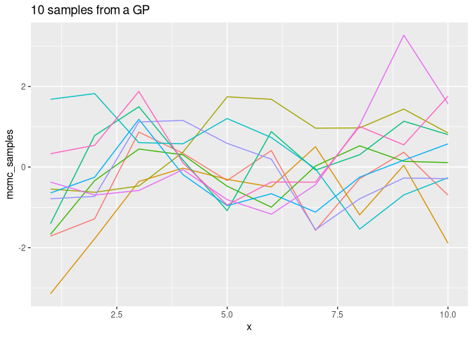

gaussian processes
================
FZ
3/18/2021

## Libraries

``` r
library(tidyverse)
```

    ## ── Attaching packages ─────────────────────────────────────── tidyverse 1.3.0 ──

    ## ✓ ggplot2 3.3.3     ✓ purrr   0.3.4
    ## ✓ tibble  3.0.6     ✓ dplyr   1.0.4
    ## ✓ tidyr   1.1.2     ✓ stringr 1.4.0
    ## ✓ readr   1.4.0     ✓ forcats 0.5.1

    ## ── Conflicts ────────────────────────────────────────── tidyverse_conflicts() ──
    ## x dplyr::filter() masks stats::filter()
    ## x dplyr::lag()    masks stats::lag()

``` r
library(rstan)
```

    ## Loading required package: StanHeaders

    ## rstan (Version 2.21.2, GitRev: 2e1f913d3ca3)

    ## For execution on a local, multicore CPU with excess RAM we recommend calling
    ## options(mc.cores = parallel::detectCores()).
    ## To avoid recompilation of unchanged Stan programs, we recommend calling
    ## rstan_options(auto_write = TRUE)

    ## 
    ## Attaching package: 'rstan'

    ## The following object is masked from 'package:tidyr':
    ## 
    ##     extract

``` r
library(rstanarm)
```

    ## Loading required package: Rcpp

    ## This is rstanarm version 2.21.1

    ## - See https://mc-stan.org/rstanarm/articles/priors for changes to default priors!

    ## - Default priors may change, so it's safest to specify priors, even if equivalent to the defaults.

    ## - For execution on a local, multicore CPU with excess RAM we recommend calling

    ##   options(mc.cores = parallel::detectCores())

    ## 
    ## Attaching package: 'rstanarm'

    ## The following object is masked from 'package:rstan':
    ## 
    ##     loo

``` r
library(bayesplot)
```

    ## This is bayesplot version 1.8.0

    ## - Online documentation and vignettes at mc-stan.org/bayesplot

    ## - bayesplot theme set to bayesplot::theme_default()

    ##    * Does _not_ affect other ggplot2 plots

    ##    * See ?bayesplot_theme_set for details on theme setting

## GP over 5 points:

``` stan
data {
  int<lower=1> N;
  real x[N];
}

transformed data {
  matrix[N, N] K;
  vector[N] mu = rep_vector(0, N);
  for (i in 1:(N - 1)) {
    K[i, i] = 1 + 0.1;
    for (j in (i + 1):N) {
      K[i, j] = exp(-0.5 * square(x[i] - x[j]));
      K[j, i] = K[i, j];
    }
  }
  K[N, N] = 1 + 0.1;
}
parameters {
  vector[N] y;
}
model {
  y ~ multi_normal(mu, K);
}
  
```

## Fitting the model:

``` r
gp_data <- list(N = 10, x = seq(1, 10))
gp_data
```

    ## $N
    ## [1] 10
    ## 
    ## $x
    ##  [1]  1  2  3  4  5  6  7  8  9 10

``` r
fit = sampling(object = gp1, data = gp_data)
```

    ## 
    ## SAMPLING FOR MODEL '2b5d01b12e63cfef128b895396667d8f' NOW (CHAIN 1).
    ## Chain 1: 
    ## Chain 1: Gradient evaluation took 2.1e-05 seconds
    ## Chain 1: 1000 transitions using 10 leapfrog steps per transition would take 0.21 seconds.
    ## Chain 1: Adjust your expectations accordingly!
    ## Chain 1: 
    ## Chain 1: 
    ## Chain 1: Iteration:    1 / 2000 [  0%]  (Warmup)
    ## Chain 1: Iteration:  200 / 2000 [ 10%]  (Warmup)
    ## Chain 1: Iteration:  400 / 2000 [ 20%]  (Warmup)
    ## Chain 1: Iteration:  600 / 2000 [ 30%]  (Warmup)
    ## Chain 1: Iteration:  800 / 2000 [ 40%]  (Warmup)
    ## Chain 1: Iteration: 1000 / 2000 [ 50%]  (Warmup)
    ## Chain 1: Iteration: 1001 / 2000 [ 50%]  (Sampling)
    ## Chain 1: Iteration: 1200 / 2000 [ 60%]  (Sampling)
    ## Chain 1: Iteration: 1400 / 2000 [ 70%]  (Sampling)
    ## Chain 1: Iteration: 1600 / 2000 [ 80%]  (Sampling)
    ## Chain 1: Iteration: 1800 / 2000 [ 90%]  (Sampling)
    ## Chain 1: Iteration: 2000 / 2000 [100%]  (Sampling)
    ## Chain 1: 
    ## Chain 1:  Elapsed Time: 0.048473 seconds (Warm-up)
    ## Chain 1:                0.048868 seconds (Sampling)
    ## Chain 1:                0.097341 seconds (Total)
    ## Chain 1: 
    ## 
    ## SAMPLING FOR MODEL '2b5d01b12e63cfef128b895396667d8f' NOW (CHAIN 2).
    ## Chain 2: 
    ## Chain 2: Gradient evaluation took 9e-06 seconds
    ## Chain 2: 1000 transitions using 10 leapfrog steps per transition would take 0.09 seconds.
    ## Chain 2: Adjust your expectations accordingly!
    ## Chain 2: 
    ## Chain 2: 
    ## Chain 2: Iteration:    1 / 2000 [  0%]  (Warmup)
    ## Chain 2: Iteration:  200 / 2000 [ 10%]  (Warmup)
    ## Chain 2: Iteration:  400 / 2000 [ 20%]  (Warmup)
    ## Chain 2: Iteration:  600 / 2000 [ 30%]  (Warmup)
    ## Chain 2: Iteration:  800 / 2000 [ 40%]  (Warmup)
    ## Chain 2: Iteration: 1000 / 2000 [ 50%]  (Warmup)
    ## Chain 2: Iteration: 1001 / 2000 [ 50%]  (Sampling)
    ## Chain 2: Iteration: 1200 / 2000 [ 60%]  (Sampling)
    ## Chain 2: Iteration: 1400 / 2000 [ 70%]  (Sampling)
    ## Chain 2: Iteration: 1600 / 2000 [ 80%]  (Sampling)
    ## Chain 2: Iteration: 1800 / 2000 [ 90%]  (Sampling)
    ## Chain 2: Iteration: 2000 / 2000 [100%]  (Sampling)
    ## Chain 2: 
    ## Chain 2:  Elapsed Time: 0.05008 seconds (Warm-up)
    ## Chain 2:                0.051835 seconds (Sampling)
    ## Chain 2:                0.101915 seconds (Total)
    ## Chain 2: 
    ## 
    ## SAMPLING FOR MODEL '2b5d01b12e63cfef128b895396667d8f' NOW (CHAIN 3).
    ## Chain 3: 
    ## Chain 3: Gradient evaluation took 9e-06 seconds
    ## Chain 3: 1000 transitions using 10 leapfrog steps per transition would take 0.09 seconds.
    ## Chain 3: Adjust your expectations accordingly!
    ## Chain 3: 
    ## Chain 3: 
    ## Chain 3: Iteration:    1 / 2000 [  0%]  (Warmup)
    ## Chain 3: Iteration:  200 / 2000 [ 10%]  (Warmup)
    ## Chain 3: Iteration:  400 / 2000 [ 20%]  (Warmup)
    ## Chain 3: Iteration:  600 / 2000 [ 30%]  (Warmup)
    ## Chain 3: Iteration:  800 / 2000 [ 40%]  (Warmup)
    ## Chain 3: Iteration: 1000 / 2000 [ 50%]  (Warmup)
    ## Chain 3: Iteration: 1001 / 2000 [ 50%]  (Sampling)
    ## Chain 3: Iteration: 1200 / 2000 [ 60%]  (Sampling)
    ## Chain 3: Iteration: 1400 / 2000 [ 70%]  (Sampling)
    ## Chain 3: Iteration: 1600 / 2000 [ 80%]  (Sampling)
    ## Chain 3: Iteration: 1800 / 2000 [ 90%]  (Sampling)
    ## Chain 3: Iteration: 2000 / 2000 [100%]  (Sampling)
    ## Chain 3: 
    ## Chain 3:  Elapsed Time: 0.04923 seconds (Warm-up)
    ## Chain 3:                0.051857 seconds (Sampling)
    ## Chain 3:                0.101087 seconds (Total)
    ## Chain 3: 
    ## 
    ## SAMPLING FOR MODEL '2b5d01b12e63cfef128b895396667d8f' NOW (CHAIN 4).
    ## Chain 4: 
    ## Chain 4: Gradient evaluation took 9e-06 seconds
    ## Chain 4: 1000 transitions using 10 leapfrog steps per transition would take 0.09 seconds.
    ## Chain 4: Adjust your expectations accordingly!
    ## Chain 4: 
    ## Chain 4: 
    ## Chain 4: Iteration:    1 / 2000 [  0%]  (Warmup)
    ## Chain 4: Iteration:  200 / 2000 [ 10%]  (Warmup)
    ## Chain 4: Iteration:  400 / 2000 [ 20%]  (Warmup)
    ## Chain 4: Iteration:  600 / 2000 [ 30%]  (Warmup)
    ## Chain 4: Iteration:  800 / 2000 [ 40%]  (Warmup)
    ## Chain 4: Iteration: 1000 / 2000 [ 50%]  (Warmup)
    ## Chain 4: Iteration: 1001 / 2000 [ 50%]  (Sampling)
    ## Chain 4: Iteration: 1200 / 2000 [ 60%]  (Sampling)
    ## Chain 4: Iteration: 1400 / 2000 [ 70%]  (Sampling)
    ## Chain 4: Iteration: 1600 / 2000 [ 80%]  (Sampling)
    ## Chain 4: Iteration: 1800 / 2000 [ 90%]  (Sampling)
    ## Chain 4: Iteration: 2000 / 2000 [100%]  (Sampling)
    ## Chain 4: 
    ## Chain 4:  Elapsed Time: 0.050536 seconds (Warm-up)
    ## Chain 4:                0.050853 seconds (Sampling)
    ## Chain 4:                0.101389 seconds (Total)
    ## Chain 4:

### Posterior Samples from a GP:

``` r
posterior <- extract(fit, inc_warmup = FALSE)

n_samples <- dim(posterior$y)[1]

as.tibble(posterior$y) %>%
  mutate(sample_n = 1:n_samples) %>%
  pivot_longer(cols = -sample_n, names_to = "vars", values_to = "mcmc_samples") %>%
  filter(sample_n <= 10) %>%
  mutate(x = rep(1:10, 10), sample_n = factor(sample_n)) %>%
  ggplot(aes(x, mcmc_samples, color = sample_n)) +
  geom_line() +
  labs(title = "10 samples from a GP") +
  theme(legend.position = "none")
```

    ## Warning: `as.tibble()` was deprecated in tibble 2.0.0.
    ## Please use `as_tibble()` instead.
    ## The signature and semantics have changed, see `?as_tibble`.

    ## Warning: The `x` argument of `as_tibble.matrix()` must have unique column names if `.name_repair` is omitted as of tibble 2.0.0.
    ## Using compatibility `.name_repair`.

<!-- -->

## Fitting a GP:

1- Estimate the params \| data. 2- Plug-in the params and predict.

``` stan
data {
  int<lower=1> N;
  real x[N];
  vector[N] y;
}

transformed data {
  vector[N] mu = rep_vector(0, N);
}

parameters {
  real<lower=0> rho;
  real<lower=0> alpha;
  real<lower=0> sigma;
}

model {
  matrix[N, N] L_K;
  matrix[N, N] K = cov_exp_quad(x, alpha, rho);
  real sq_sigma = square(sigma);

  // diagonal elements
  for (n in 1:N)
    K[n, n] = K[n, n] + sq_sigma;

  L_K = cholesky_decompose(K);

  rho ~ inv_gamma(5, 5);
  alpha ~ std_normal();
  sigma ~ std_normal();

  y ~ multi_normal_cholesky(mu, L_K);
}
```

## Estimating the parameters:

``` r
N <- 30
x <- seq(0, 2, length.out = N)
y <- sin(x) + rnorm(N, 0, 1)

gp_params_data <- list(N = N, x = x, y = y)
gp_params_data
```

    ## $N
    ## [1] 30
    ## 
    ## $x
    ##  [1] 0.00000000 0.06896552 0.13793103 0.20689655 0.27586207 0.34482759
    ##  [7] 0.41379310 0.48275862 0.55172414 0.62068966 0.68965517 0.75862069
    ## [13] 0.82758621 0.89655172 0.96551724 1.03448276 1.10344828 1.17241379
    ## [19] 1.24137931 1.31034483 1.37931034 1.44827586 1.51724138 1.58620690
    ## [25] 1.65517241 1.72413793 1.79310345 1.86206897 1.93103448 2.00000000
    ## 
    ## $y
    ##  [1] -1.4952526  0.1170724 -1.7482671  0.3285903  0.2616188  1.9291147
    ##  [7]  1.2911629  1.1335893  0.4763955  1.7236884  1.9168440  0.5568567
    ## [13] -0.3337995  0.6189349 -0.5119549  1.5346077  2.4562981  0.8661007
    ## [19]  1.6642649  1.0093433  1.0298097 -1.2582765  0.9858046  0.4880863
    ## [25]  0.5152350  1.0387495  0.3388913  0.4580377 -0.4838150 -1.3741807

``` r
fit_params = sampling(object = gp_params, data = gp_params_data)
```

    ## 
    ## SAMPLING FOR MODEL '8ca67fd9ca46924c00e121924f3206a1' NOW (CHAIN 1).
    ## Chain 1: 
    ## Chain 1: Gradient evaluation took 8.6e-05 seconds
    ## Chain 1: 1000 transitions using 10 leapfrog steps per transition would take 0.86 seconds.
    ## Chain 1: Adjust your expectations accordingly!
    ## Chain 1: 
    ## Chain 1: 
    ## Chain 1: Iteration:    1 / 2000 [  0%]  (Warmup)
    ## Chain 1: Iteration:  200 / 2000 [ 10%]  (Warmup)
    ## Chain 1: Iteration:  400 / 2000 [ 20%]  (Warmup)
    ## Chain 1: Iteration:  600 / 2000 [ 30%]  (Warmup)
    ## Chain 1: Iteration:  800 / 2000 [ 40%]  (Warmup)
    ## Chain 1: Iteration: 1000 / 2000 [ 50%]  (Warmup)
    ## Chain 1: Iteration: 1001 / 2000 [ 50%]  (Sampling)
    ## Chain 1: Iteration: 1200 / 2000 [ 60%]  (Sampling)
    ## Chain 1: Iteration: 1400 / 2000 [ 70%]  (Sampling)
    ## Chain 1: Iteration: 1600 / 2000 [ 80%]  (Sampling)
    ## Chain 1: Iteration: 1800 / 2000 [ 90%]  (Sampling)
    ## Chain 1: Iteration: 2000 / 2000 [100%]  (Sampling)
    ## Chain 1: 
    ## Chain 1:  Elapsed Time: 0.337969 seconds (Warm-up)
    ## Chain 1:                0.318819 seconds (Sampling)
    ## Chain 1:                0.656788 seconds (Total)
    ## Chain 1: 
    ## 
    ## SAMPLING FOR MODEL '8ca67fd9ca46924c00e121924f3206a1' NOW (CHAIN 2).
    ## Chain 2: 
    ## Chain 2: Gradient evaluation took 6.2e-05 seconds
    ## Chain 2: 1000 transitions using 10 leapfrog steps per transition would take 0.62 seconds.
    ## Chain 2: Adjust your expectations accordingly!
    ## Chain 2: 
    ## Chain 2: 
    ## Chain 2: Iteration:    1 / 2000 [  0%]  (Warmup)
    ## Chain 2: Iteration:  200 / 2000 [ 10%]  (Warmup)
    ## Chain 2: Iteration:  400 / 2000 [ 20%]  (Warmup)
    ## Chain 2: Iteration:  600 / 2000 [ 30%]  (Warmup)
    ## Chain 2: Iteration:  800 / 2000 [ 40%]  (Warmup)
    ## Chain 2: Iteration: 1000 / 2000 [ 50%]  (Warmup)
    ## Chain 2: Iteration: 1001 / 2000 [ 50%]  (Sampling)
    ## Chain 2: Iteration: 1200 / 2000 [ 60%]  (Sampling)
    ## Chain 2: Iteration: 1400 / 2000 [ 70%]  (Sampling)
    ## Chain 2: Iteration: 1600 / 2000 [ 80%]  (Sampling)
    ## Chain 2: Iteration: 1800 / 2000 [ 90%]  (Sampling)
    ## Chain 2: Iteration: 2000 / 2000 [100%]  (Sampling)
    ## Chain 2: 
    ## Chain 2:  Elapsed Time: 0.349505 seconds (Warm-up)
    ## Chain 2:                0.340749 seconds (Sampling)
    ## Chain 2:                0.690254 seconds (Total)
    ## Chain 2: 
    ## 
    ## SAMPLING FOR MODEL '8ca67fd9ca46924c00e121924f3206a1' NOW (CHAIN 3).
    ## Chain 3: 
    ## Chain 3: Gradient evaluation took 6.2e-05 seconds
    ## Chain 3: 1000 transitions using 10 leapfrog steps per transition would take 0.62 seconds.
    ## Chain 3: Adjust your expectations accordingly!
    ## Chain 3: 
    ## Chain 3: 
    ## Chain 3: Iteration:    1 / 2000 [  0%]  (Warmup)
    ## Chain 3: Iteration:  200 / 2000 [ 10%]  (Warmup)
    ## Chain 3: Iteration:  400 / 2000 [ 20%]  (Warmup)
    ## Chain 3: Iteration:  600 / 2000 [ 30%]  (Warmup)
    ## Chain 3: Iteration:  800 / 2000 [ 40%]  (Warmup)
    ## Chain 3: Iteration: 1000 / 2000 [ 50%]  (Warmup)
    ## Chain 3: Iteration: 1001 / 2000 [ 50%]  (Sampling)
    ## Chain 3: Iteration: 1200 / 2000 [ 60%]  (Sampling)
    ## Chain 3: Iteration: 1400 / 2000 [ 70%]  (Sampling)
    ## Chain 3: Iteration: 1600 / 2000 [ 80%]  (Sampling)
    ## Chain 3: Iteration: 1800 / 2000 [ 90%]  (Sampling)
    ## Chain 3: Iteration: 2000 / 2000 [100%]  (Sampling)
    ## Chain 3: 
    ## Chain 3:  Elapsed Time: 0.345961 seconds (Warm-up)
    ## Chain 3:                0.345461 seconds (Sampling)
    ## Chain 3:                0.691422 seconds (Total)
    ## Chain 3: 
    ## 
    ## SAMPLING FOR MODEL '8ca67fd9ca46924c00e121924f3206a1' NOW (CHAIN 4).
    ## Chain 4: 
    ## Chain 4: Gradient evaluation took 5.9e-05 seconds
    ## Chain 4: 1000 transitions using 10 leapfrog steps per transition would take 0.59 seconds.
    ## Chain 4: Adjust your expectations accordingly!
    ## Chain 4: 
    ## Chain 4: 
    ## Chain 4: Iteration:    1 / 2000 [  0%]  (Warmup)
    ## Chain 4: Iteration:  200 / 2000 [ 10%]  (Warmup)
    ## Chain 4: Iteration:  400 / 2000 [ 20%]  (Warmup)
    ## Chain 4: Iteration:  600 / 2000 [ 30%]  (Warmup)
    ## Chain 4: Iteration:  800 / 2000 [ 40%]  (Warmup)
    ## Chain 4: Iteration: 1000 / 2000 [ 50%]  (Warmup)
    ## Chain 4: Iteration: 1001 / 2000 [ 50%]  (Sampling)
    ## Chain 4: Iteration: 1200 / 2000 [ 60%]  (Sampling)
    ## Chain 4: Iteration: 1400 / 2000 [ 70%]  (Sampling)
    ## Chain 4: Iteration: 1600 / 2000 [ 80%]  (Sampling)
    ## Chain 4: Iteration: 1800 / 2000 [ 90%]  (Sampling)
    ## Chain 4: Iteration: 2000 / 2000 [100%]  (Sampling)
    ## Chain 4: 
    ## Chain 4:  Elapsed Time: 0.350375 seconds (Warm-up)
    ## Chain 4:                0.337449 seconds (Sampling)
    ## Chain 4:                0.687824 seconds (Total)
    ## Chain 4:

``` r
summary(fit_params)
```

    ## $summary
    ##              mean     se_mean        sd        2.5%         25%         50%
    ## rho     1.0001753 0.011493040 0.5214375   0.4445055   0.6920749   0.8896029
    ## alpha   0.8827262 0.008919242 0.4748146   0.1897320   0.5313382   0.8107849
    ## sigma   0.9997257 0.002831947 0.1427241   0.7526481   0.8997650   0.9841967
    ## lp__  -24.1496146 0.035863050 1.3672905 -27.6826649 -24.7419170 -23.8283218
    ##              75%      97.5%    n_eff     Rhat
    ## rho     1.138131   2.299744 2058.423 1.000459
    ## alpha   1.150874   1.980028 2833.950 1.002766
    ## sigma   1.086717   1.316336 2539.944 1.002461
    ## lp__  -23.139045 -22.591252 1453.541 1.002254
    ## 
    ## $c_summary
    ## , , chains = chain:1
    ## 
    ##          stats
    ## parameter        mean        sd        2.5%         25%         50%        75%
    ##     rho     1.0013761 0.5622301   0.4638301   0.7009627   0.8928473   1.119697
    ##     alpha   0.8439101 0.4640016   0.1709341   0.5146897   0.7702187   1.080266
    ##     sigma   1.0131917 0.1433693   0.7660517   0.9105530   0.9976209   1.100153
    ##     lp__  -24.1482733 1.4111336 -27.8256808 -24.7550720 -23.8268254 -23.100892
    ##          stats
    ## parameter      97.5%
    ##     rho     2.256536
    ##     alpha   1.955260
    ##     sigma   1.329995
    ##     lp__  -22.597962
    ## 
    ## , , chains = chain:2
    ## 
    ##          stats
    ## parameter        mean        sd        2.5%         25%         50%        75%
    ##     rho     1.0347434 0.5547786   0.4516889   0.7058368   0.9120277   1.190092
    ##     alpha   0.8786836 0.4862396   0.1755961   0.5129088   0.7937086   1.180718
    ##     sigma   0.9974582 0.1400358   0.7635876   0.8972647   0.9792522   1.088515
    ##     lp__  -24.2290096 1.4825348 -28.1779248 -24.7870935 -23.8265732 -23.201919
    ##          stats
    ## parameter      97.5%
    ##     rho     2.621303
    ##     alpha   1.928084
    ##     sigma   1.314021
    ##     lp__  -22.604296
    ## 
    ## , , chains = chain:3
    ## 
    ##          stats
    ## parameter        mean        sd        2.5%         25%         50%        75%
    ##     rho     0.9878268 0.4715831   0.4343861   0.6847566   0.8943774   1.136556
    ##     alpha   0.8846707 0.4816487   0.2068558   0.5200168   0.8071560   1.161046
    ##     sigma   0.9926270 0.1453174   0.7367658   0.8926148   0.9804877   1.085530
    ##     lp__  -24.1702244 1.3227180 -27.5702853 -24.7253611 -23.8770379 -23.158790
    ##          stats
    ## parameter      97.5%
    ##     rho     2.154094
    ##     alpha   1.990197
    ##     sigma   1.306290
    ##     lp__  -22.597914
    ## 
    ## , , chains = chain:4
    ## 
    ##          stats
    ## parameter        mean        sd        2.5%         25%         50%        75%
    ##     rho     0.9767550 0.4901354   0.4450087   0.6858285   0.8700203   1.122831
    ##     alpha   0.9236404 0.4642808   0.2349295   0.5895466   0.8632935   1.183301
    ##     sigma   0.9956259 0.1414423   0.7432814   0.8993670   0.9828272   1.080510
    ##     lp__  -24.0509511 1.2362345 -26.9487315 -24.7104107 -23.7747575 -23.095447
    ##          stats
    ## parameter      97.5%
    ##     rho     2.243512
    ##     alpha   2.021161
    ##     sigma   1.298929
    ##     lp__  -22.576765

``` r
param_posteriors <- extract(fit_params, inc_warmup = TRUE, permuted = FALSE)

color_scheme_set("mix-blue-pink")
p <- mcmc_trace(param_posteriors,  pars = c("rho", "alpha", "sigma"), n_warmup = 300,
                facet_args = list(nrow = 2, labeller = label_parsed))
p + facet_text(size = 15)
```

<!-- -->

``` r
mcmc_areas(fit_params, regex_pars = c("rho", "alpha", "sigma"),  prob = 0.8) +
 labs(
   title = "Posterior distributions",
   subtitle = "with medians and 80% intervals"
 )
```

<!-- -->

``` r
fit_params
```

    ## Inference for Stan model: 8ca67fd9ca46924c00e121924f3206a1.
    ## 4 chains, each with iter=2000; warmup=1000; thin=1; 
    ## post-warmup draws per chain=1000, total post-warmup draws=4000.
    ## 
    ##         mean se_mean   sd   2.5%    25%    50%    75%  97.5% n_eff Rhat
    ## rho     1.00    0.01 0.52   0.44   0.69   0.89   1.14   2.30  2058    1
    ## alpha   0.88    0.01 0.47   0.19   0.53   0.81   1.15   1.98  2834    1
    ## sigma   1.00    0.00 0.14   0.75   0.90   0.98   1.09   1.32  2540    1
    ## lp__  -24.15    0.04 1.37 -27.68 -24.74 -23.83 -23.14 -22.59  1454    1
    ## 
    ## Samples were drawn using NUTS(diag_e) at Thu Mar 18 15:31:06 2021.
    ## For each parameter, n_eff is a crude measure of effective sample size,
    ## and Rhat is the potential scale reduction factor on split chains (at 
    ## convergence, Rhat=1).

``` r
as.tibble(extract(fit_params)) %>%
  select(-lp__) %>%
  pivot_longer(cols = c("rho", "alpha", "sigma"), 
               names_to = "param", values_to = "mcmc_estimate") %>%
  group_by(param) %>%
  summarise(mean_p = mean(mcmc_estimate), sd_p = sd(mcmc_estimate))
```

    ## # A tibble: 3 x 3
    ##   param mean_p  sd_p
    ## * <chr>  <dbl> <dbl>
    ## 1 alpha  0.883 0.475
    ## 2 rho    1.00  0.521
    ## 3 sigma  1.00  0.143
