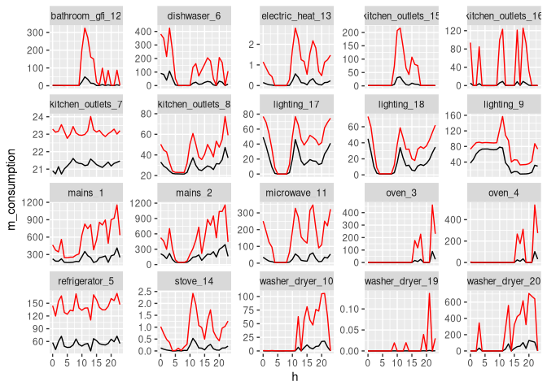

energy\_data
================
FZ
4/9/2021

## Libraries

``` r
library(tidyverse)
```

    ## ── Attaching packages ─────────────────────────────────────── tidyverse 1.3.0 ──

    ## ✓ ggplot2 3.3.3     ✓ purrr   0.3.4
    ## ✓ tibble  3.0.6     ✓ dplyr   1.0.4
    ## ✓ tidyr   1.1.2     ✓ stringr 1.4.0
    ## ✓ readr   1.4.0     ✓ forcats 0.5.1

    ## ── Conflicts ────────────────────────────────────────── tidyverse_conflicts() ──
    ## x dplyr::filter() masks stats::filter()
    ## x dplyr::lag()    masks stats::lag()

``` r
library(lubridate)
```

    ## 
    ## Attaching package: 'lubridate'

    ## The following objects are masked from 'package:base':
    ## 
    ##     date, intersect, setdiff, union

## Data

Data is collected very irregularly over time. Only useful at day-scale.
Some houses have less data than others (\|house1\| &gt; \|house4\|).

``` r
house <- read_csv("data/house1.csv") %>%
  rename(date = "X1") %>%
  mutate(date = ymd_hms(date), 
         h = hour(date), m = minute(date), s = second(date)) %>%
  unite("time", c("h", "m", "s"), sep = ":")
```

    ## Warning: Missing column names filled in: 'X1' [1]

    ## 
    ## ── Column specification ────────────────────────────────────────────────────────
    ## cols(
    ##   .default = col_double(),
    ##   X1 = col_datetime(format = "")
    ## )
    ## ℹ Use `spec()` for the full column specifications.

``` r
house %>% names()
```

    ##  [1] "date"               "mains_1"            "mains_2"           
    ##  [4] "oven_3"             "oven_4"             "refrigerator_5"    
    ##  [7] "dishwaser_6"        "kitchen_outlets_7"  "kitchen_outlets_8" 
    ## [10] "lighting_9"         "washer_dryer_10"    "microwave_11"      
    ## [13] "bathroom_gfi_12"    "electric_heat_13"   "stove_14"          
    ## [16] "kitchen_outlets_15" "kitchen_outlets_16" "lighting_17"       
    ## [19] "lighting_18"        "washer_dryer_19"    "washer_dryer_20"   
    ## [22] "time"

``` r
house %>% head()
```

    ## # A tibble: 6 x 22
    ##   date                mains_1 mains_2 oven_3 oven_4 refrigerator_5 dishwaser_6
    ##   <dttm>                <dbl>   <dbl>  <dbl>  <dbl>          <dbl>       <dbl>
    ## 1 2011-04-18 13:22:13    222.    119.      0      0              6           0
    ## 2 2011-04-18 13:22:16    223.    119.      0      0              6           0
    ## 3 2011-04-18 13:22:20    224.    119.      0      0              6           0
    ## 4 2011-04-18 13:22:23    223.    119.      0      0              6           1
    ## 5 2011-04-18 13:22:26    223.    119.      0      0              6           0
    ## 6 2011-04-18 13:22:30    223.    119.      0      0              6           0
    ## # … with 15 more variables: kitchen_outlets_7 <dbl>, kitchen_outlets_8 <dbl>,
    ## #   lighting_9 <dbl>, washer_dryer_10 <dbl>, microwave_11 <dbl>,
    ## #   bathroom_gfi_12 <dbl>, electric_heat_13 <dbl>, stove_14 <dbl>,
    ## #   kitchen_outlets_15 <dbl>, kitchen_outlets_16 <dbl>, lighting_17 <dbl>,
    ## #   lighting_18 <dbl>, washer_dryer_19 <dbl>, washer_dryer_20 <dbl>, time <chr>

## Data contains:

-   12 days of data in month 4 and 11 in month 5 in 2011.
-   Data is collected every second all day long.

``` r
house %>%
  distinct(year(date), month = month(date), day = day(date)) %>%
  mutate(n = 1) %>%
  group_by(month) %>%
  summarise(sum(n))
```

    ## # A tibble: 2 x 2
    ##   month `sum(n)`
    ## * <dbl>    <dbl>
    ## 1     4       12
    ## 2     5       11

``` r
house %>%
  distinct(second = second(date)) %>%
  arrange(second)
```

    ## # A tibble: 60 x 1
    ##    second
    ##     <dbl>
    ##  1      0
    ##  2      1
    ##  3      2
    ##  4      3
    ##  5      4
    ##  6      5
    ##  7      6
    ##  8      7
    ##  9      8
    ## 10      9
    ## # … with 50 more rows

``` r
house %>%
  distinct(hour = hour(date)) %>%
  arrange(hour)
```

    ## # A tibble: 24 x 1
    ##     hour
    ##    <int>
    ##  1     0
    ##  2     1
    ##  3     2
    ##  4     3
    ##  5     4
    ##  6     5
    ##  7     6
    ##  8     7
    ##  9     8
    ## 10     9
    ## # … with 14 more rows

``` r
house %>%
  dim()
```

    ## [1] 406748     22

-   23 consecutive days since April to May 27.

``` r
house %>%
  distinct(d = day(date), m = month(date)) %>%
  arrange(m, d)
```

    ## # A tibble: 23 x 2
    ##        d     m
    ##    <int> <dbl>
    ##  1    18     4
    ##  2    19     4
    ##  3    20     4
    ##  4    21     4
    ##  5    22     4
    ##  6    23     4
    ##  7    24     4
    ##  8    25     4
    ##  9    26     4
    ## 10    27     4
    ## # … with 13 more rows

## All appliances:

``` r
house %>%
  pivot_longer(cols = -c(date, time), 
               names_to = "appliance", values_to = "consumption") %>%
  ggplot(aes(date, consumption, color = appliance)) +
  geom_line() +
  facet_wrap(~appliance, scales = "free_y") +
  theme(legend.position = "none", 
        axis.text.x = element_text(angle = 90, vjust = 0.5, hjust=1))
```

<!-- -->

-   Daily consumption changes over time: no consumption around may 16.

``` r
house %>%
  filter(day(date) == 20) %>%
  pivot_longer(cols = -c(date, time), 
               names_to = "appliance", values_to = "consumption") %>%
  ggplot(aes(date, consumption)) +
  geom_line() +
  facet_wrap(~appliance, scales = "free_y") +
  theme(legend.position = "none", 
        axis.text.x = element_text(angle = 90, vjust = 0.5, hjust=1)) +
  labs(title = "A Day of consumption")
```

<!-- -->

``` r
mean_hour_c <-
  house %>%
    pivot_longer(cols = -c(date, time), 
                 names_to = "appliance", values_to = "consumption") %>%
    mutate(h = hour(date)) %>%
    group_by(appliance, h) %>%
    summarise(m_consumption = mean(consumption), 
              sd_consumption = sd(consumption)) 
```

    ## `summarise()` has grouped output by 'appliance'. You can override using the `.groups` argument.

### High variance but same pattern:

``` r
mean_hour_c %>%
  ggplot() +
  geom_line(aes(h, m_consumption)) +
  facet_wrap(~appliance, scales = "free_y") +
  theme(legend.position = "none")
```

<!-- -->

``` r
mean_hour_c %>%
  ggplot() +
  geom_line(aes(h, m_consumption)) +
  geom_line(aes(h, m_consumption + sd_consumption), color = "red") +
  facet_wrap(~appliance, scales = "free_y") +
  theme(legend.position = "none")
```

<!-- --> \#\#\#
What do different households have in common?

``` r
house_files = list.files(path = "./data/", pattern = ".csv")
n_houses <- length(house_files)
house_dfs <- lapply(paste("./data/", house_files, sep = ""), read_csv)
```

    ## Warning: Missing column names filled in: 'X1' [1]

    ## 
    ## ── Column specification ────────────────────────────────────────────────────────
    ## cols(
    ##   .default = col_double(),
    ##   X1 = col_datetime(format = "")
    ## )
    ## ℹ Use `spec()` for the full column specifications.

    ## Warning: Missing column names filled in: 'X1' [1]

    ## 
    ## ── Column specification ────────────────────────────────────────────────────────
    ## cols(
    ##   X1 = col_datetime(format = ""),
    ##   mains_1 = col_double(),
    ##   mains_2 = col_double(),
    ##   kitchen_outlets_3 = col_double(),
    ##   lighting_4 = col_double(),
    ##   stove_5 = col_double(),
    ##   microwave_6 = col_double(),
    ##   washer_dryer_7 = col_double(),
    ##   kitchen_outlets_8 = col_double(),
    ##   refrigerator_9 = col_double(),
    ##   dishwaser_10 = col_double(),
    ##   disposal_11 = col_double()
    ## )

    ## Warning: Missing column names filled in: 'X1' [1]

    ## 
    ## ── Column specification ────────────────────────────────────────────────────────
    ## cols(
    ##   .default = col_double(),
    ##   X1 = col_datetime(format = "")
    ## )
    ## ℹ Use `spec()` for the full column specifications.

    ## Warning: Missing column names filled in: 'X1' [1]

    ## 
    ## ── Column specification ────────────────────────────────────────────────────────
    ## cols(
    ##   .default = col_double(),
    ##   X1 = col_datetime(format = "")
    ## )
    ## ℹ Use `spec()` for the full column specifications.

    ## Warning: Missing column names filled in: 'X1' [1]

    ## 
    ## ── Column specification ────────────────────────────────────────────────────────
    ## cols(
    ##   .default = col_double(),
    ##   X1 = col_datetime(format = "")
    ## )
    ## ℹ Use `spec()` for the full column specifications.

    ## Warning: Missing column names filled in: 'X1' [1]

    ## 
    ## ── Column specification ────────────────────────────────────────────────────────
    ## cols(
    ##   X1 = col_datetime(format = ""),
    ##   mains_1 = col_double(),
    ##   mains_2 = col_double(),
    ##   kitchen_outlets_3 = col_double(),
    ##   washer_dryer_4 = col_double(),
    ##   stove_5 = col_double(),
    ##   electronics_6 = col_double(),
    ##   bathroom_gfi_7 = col_double(),
    ##   refrigerator_8 = col_double(),
    ##   dishwaser_9 = col_double(),
    ##   outlets_unknown_10 = col_double(),
    ##   outlets_unknown_11 = col_double(),
    ##   electric_heat_12 = col_double(),
    ##   kitchen_outlets_13 = col_double(),
    ##   lighting_14 = col_double(),
    ##   air_conditioning_15 = col_double(),
    ##   air_conditioning_16 = col_double(),
    ##   air_conditioning_17 = col_double()
    ## )

``` r
process_data <- function(df, house_number) {
  
    df <-
      df %>%
      rename(date = "X1") %>%
      mutate(house = house_number, 
             date = ymd_hms(date), 
             h = hour(date), m = minute(date), s = second(date)) %>%
      unite("time", c("h", "m", "s"), sep = ":") %>%
      pivot_longer(cols = -c(date, time, house), 
                   names_to = "appliance", values_to = "consumption") %>%
      mutate(h = hour(date)) %>%
      group_by(house, appliance, h) %>%
      summarise(m_consumption = mean(consumption), 
                sd_consumption = sd(consumption)) 
    
    return(df)
}

house1_msd <- process_data(house_dfs[[1]], 1)
```

    ## `summarise()` has grouped output by 'house', 'appliance'. You can override using the `.groups` argument.

``` r
house2_msd <- process_data(house_dfs[[2]], 2)
```

    ## `summarise()` has grouped output by 'house', 'appliance'. You can override using the `.groups` argument.

``` r
house3_msd <- process_data(house_dfs[[3]], 3)
```

    ## `summarise()` has grouped output by 'house', 'appliance'. You can override using the `.groups` argument.

``` r
house4_msd <- process_data(house_dfs[[4]], 4)
```

    ## `summarise()` has grouped output by 'house', 'appliance'. You can override using the `.groups` argument.

``` r
house5_msd <- process_data(house_dfs[[5]], 5)
```

    ## `summarise()` has grouped output by 'house', 'appliance'. You can override using the `.groups` argument.

``` r
house6_msd <- process_data(house_dfs[[6]], 6)
```

    ## `summarise()` has grouped output by 'house', 'appliance'. You can override using the `.groups` argument.

``` r
houses <- bind_rows(house1_msd, house2_msd, house3_msd,
                    house4_msd, house5_msd, house6_msd)

houses %>% 
  distinct(appliance) %>%
  .$appliance
```

    ##   [1] "bathroom_gfi_12"     "dishwaser_6"         "electric_heat_13"   
    ##   [4] "kitchen_outlets_15"  "kitchen_outlets_16"  "kitchen_outlets_7"  
    ##   [7] "kitchen_outlets_8"   "lighting_17"         "lighting_18"        
    ##  [10] "lighting_9"          "mains_1"             "mains_2"            
    ##  [13] "microwave_11"        "oven_3"              "oven_4"             
    ##  [16] "refrigerator_5"      "stove_14"            "washer_dryer_10"    
    ##  [19] "washer_dryer_19"     "washer_dryer_20"     "dishwaser_10"       
    ##  [22] "disposal_11"         "kitchen_outlets_3"   "kitchen_outlets_8"  
    ##  [25] "lighting_4"          "mains_1"             "mains_2"            
    ##  [28] "microwave_6"         "refrigerator_9"      "stove_5"            
    ##  [31] "washer_dryer_7"      "bathroom_gfi_20"     "dishwaser_9"        
    ##  [34] "disposal_8"          "electronics_6"       "furance_10"         
    ##  [37] "kitchen_outlets_21"  "kitchen_outlets_22"  "lighting_11"        
    ##  [40] "lighting_15"         "lighting_17"         "lighting_19"        
    ##  [43] "lighting_5"          "mains_1"             "mains_2"            
    ##  [46] "microwave_16"        "outlets_unknown_12"  "outlets_unknown_3"  
    ##  [49] "outlets_unknown_4"   "refrigerator_7"      "smoke_alarms_18"    
    ##  [52] "washer_dryer_13"     "washer_dryer_14"     "air_conditioning_10"
    ##  [55] "air_conditioning_20" "air_conditioning_9"  "bathroom_gfi_16"    
    ##  [58] "bathroom_gfi_17"     "dishwaser_15"        "furance_4"          
    ##  [61] "kitchen_outlets_14"  "kitchen_outlets_5"   "lighting_13"        
    ##  [64] "lighting_18"         "lighting_19"         "lighting_3"         
    ##  [67] "mains_1"             "mains_2"             "miscellaeneous_11"  
    ##  [70] "outlets_unknown_6"   "smoke_alarms_12"     "stove_8"            
    ##  [73] "washer_dryer_7"      "bathroom_gfi_16"     "dishwaser_20"       
    ##  [76] "disposal_21"         "electric_heat_12"    "electric_heat_13"   
    ##  [79] "electronics_22"      "furance_6"           "kitchen_outlets_24" 
    ##  [82] "kitchen_outlets_25"  "lighting_14"         "lighting_17"        
    ##  [85] "lighting_19"         "lighting_23"         "lighting_4"         
    ##  [88] "mains_1"             "mains_2"             "microwave_3"        
    ##  [91] "outdoor_outlets_26"  "outlets_unknown_15"  "outlets_unknown_5"  
    ##  [94] "outlets_unknown_7"   "refrigerator_18"     "subpanel_10"        
    ##  [97] "subpanel_11"         "washer_dryer_8"      "washer_dryer_9"     
    ## [100] "air_conditioning_15" "air_conditioning_16" "air_conditioning_17"
    ## [103] "bathroom_gfi_7"      "dishwaser_9"         "electric_heat_12"   
    ## [106] "electronics_6"       "kitchen_outlets_13"  "kitchen_outlets_3"  
    ## [109] "lighting_14"         "mains_1"             "mains_2"            
    ## [112] "outlets_unknown_10"  "outlets_unknown_11"  "refrigerator_8"     
    ## [115] "stove_5"             "washer_dryer_4"
