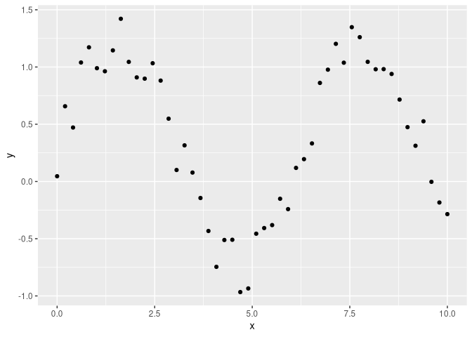
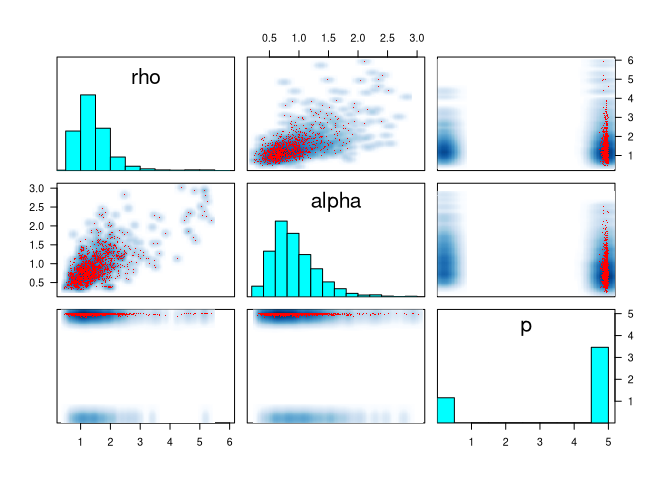
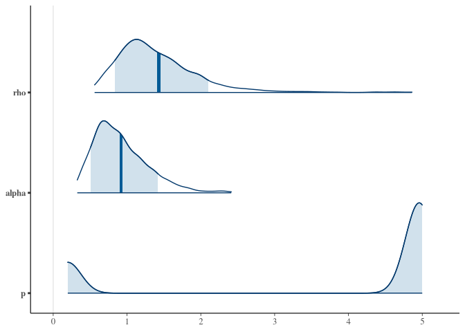

Periodic GPs
================
FZ
3/23/2021

## Estimating the period:

``` r
library(tidyverse)
```

    ## ── Attaching packages ─────────────────────────────────────── tidyverse 1.3.0 ──

    ## ✓ ggplot2 3.3.3     ✓ purrr   0.3.4
    ## ✓ tibble  3.0.6     ✓ dplyr   1.0.4
    ## ✓ tidyr   1.1.2     ✓ stringr 1.4.0
    ## ✓ readr   1.4.0     ✓ forcats 0.5.1

    ## ── Conflicts ────────────────────────────────────────── tidyverse_conflicts() ──
    ## x dplyr::filter() masks stats::filter()
    ## x dplyr::lag()    masks stats::lag()

``` r
library(rstan)
```

    ## Loading required package: StanHeaders

    ## rstan (Version 2.21.2, GitRev: 2e1f913d3ca3)

    ## For execution on a local, multicore CPU with excess RAM we recommend calling
    ## options(mc.cores = parallel::detectCores()).
    ## To avoid recompilation of unchanged Stan programs, we recommend calling
    ## rstan_options(auto_write = TRUE)

    ## 
    ## Attaching package: 'rstan'

    ## The following object is masked from 'package:tidyr':
    ## 
    ##     extract

``` r
library(bayesplot)
```

    ## This is bayesplot version 1.8.0

    ## - Online documentation and vignettes at mc-stan.org/bayesplot

    ## - bayesplot theme set to bayesplot::theme_default()

    ##    * Does _not_ affect other ggplot2 plots

    ##    * See ?bayesplot_theme_set for details on theme setting

``` r
rstan_options(auto_write = TRUE)
```

``` stan
functions {
  
  int is_week(int d) {
    if(d == 6 || d == 7)
      return 0;
    else
      return 1;
  }
  
  real exp_kern(real x1, real x2, real alpha, real rho){
    return square(alpha) * exp(-fabs(x1 - x2) / square(rho));
  }

  real periodic_kern(real x1, real x2, real alpha, real rho, real p){
    real nom = square(sin(pi()*(x1 - x2)/p));
    return square(alpha) * exp(-nom / square(rho));
  }
  
}

data {
  int<lower=1> N;
  real x[N];
  vector[N] y;
}

transformed data {
  vector[N] mu = rep_vector(0, N);
}

parameters {
  real<lower=0> rho;
  real<lower=0> alpha;
  real<lower=0> p;
  real<lower=0> sigma;
}

model {
  matrix[N, N] L_K;
  matrix[N, N] K;
  real sq_sigma = square(sigma);

  for (r in 1:N){
    for(c in 1:N){
      K[r, c] = periodic_kern(x[r], x[c], alpha, rho, p);
    }
  }
  
  // diagonal elements
  for (n in 1:N)
    K[n, n] = K[n, n] + sq_sigma;

  L_K = cholesky_decompose(K);

  rho ~ inv_gamma(5, 5);
  alpha ~ std_normal();
  p ~ uniform(0, 5);
  sigma ~ std_normal();

  y ~ multi_normal_cholesky(mu, L_K);
}

generated quantities { 
  int is_w = is_week(6);
}
```

## Periodic Kernel

``` r
N <- 50
x <- seq(0, 10, length.out = N)
y <- sin(x) + runif(N, 0, 0.5)

gp_pred_data <- list(N = N, x = x, y = y)

tibble(N, x, y) %>%
  ggplot(aes(x, y)) +
  geom_point()
```

<!-- -->

``` r
fit_pred <- sampling(gp_pred, data = gp_pred_data, 
                     iter = 2000, 
                     control = list(max_treedepth = 10))
```

    ## 
    ## SAMPLING FOR MODEL '4c88e427c40a8316210150d6bfc887dd' NOW (CHAIN 1).
    ## Chain 1: 
    ## Chain 1: Gradient evaluation took 0.001014 seconds
    ## Chain 1: 1000 transitions using 10 leapfrog steps per transition would take 10.14 seconds.
    ## Chain 1: Adjust your expectations accordingly!
    ## Chain 1: 
    ## Chain 1: 
    ## Chain 1: Iteration:    1 / 2000 [  0%]  (Warmup)
    ## Chain 1: Iteration:  200 / 2000 [ 10%]  (Warmup)
    ## Chain 1: Iteration:  400 / 2000 [ 20%]  (Warmup)
    ## Chain 1: Iteration:  600 / 2000 [ 30%]  (Warmup)
    ## Chain 1: Iteration:  800 / 2000 [ 40%]  (Warmup)
    ## Chain 1: Iteration: 1000 / 2000 [ 50%]  (Warmup)
    ## Chain 1: Iteration: 1001 / 2000 [ 50%]  (Sampling)
    ## Chain 1: Iteration: 1200 / 2000 [ 60%]  (Sampling)
    ## Chain 1: Iteration: 1400 / 2000 [ 70%]  (Sampling)
    ## Chain 1: Iteration: 1600 / 2000 [ 80%]  (Sampling)
    ## Chain 1: Iteration: 1800 / 2000 [ 90%]  (Sampling)
    ## Chain 1: Iteration: 2000 / 2000 [100%]  (Sampling)
    ## Chain 1: 
    ## Chain 1:  Elapsed Time: 7.18345 seconds (Warm-up)
    ## Chain 1:                5.5048 seconds (Sampling)
    ## Chain 1:                12.6883 seconds (Total)
    ## Chain 1: 
    ## 
    ## SAMPLING FOR MODEL '4c88e427c40a8316210150d6bfc887dd' NOW (CHAIN 2).
    ## Chain 2: 
    ## Chain 2: Gradient evaluation took 0.000636 seconds
    ## Chain 2: 1000 transitions using 10 leapfrog steps per transition would take 6.36 seconds.
    ## Chain 2: Adjust your expectations accordingly!
    ## Chain 2: 
    ## Chain 2: 
    ## Chain 2: Iteration:    1 / 2000 [  0%]  (Warmup)
    ## Chain 2: Iteration:  200 / 2000 [ 10%]  (Warmup)
    ## Chain 2: Iteration:  400 / 2000 [ 20%]  (Warmup)
    ## Chain 2: Iteration:  600 / 2000 [ 30%]  (Warmup)
    ## Chain 2: Iteration:  800 / 2000 [ 40%]  (Warmup)
    ## Chain 2: Iteration: 1000 / 2000 [ 50%]  (Warmup)
    ## Chain 2: Iteration: 1001 / 2000 [ 50%]  (Sampling)
    ## Chain 2: Iteration: 1200 / 2000 [ 60%]  (Sampling)
    ## Chain 2: Iteration: 1400 / 2000 [ 70%]  (Sampling)
    ## Chain 2: Iteration: 1600 / 2000 [ 80%]  (Sampling)
    ## Chain 2: Iteration: 1800 / 2000 [ 90%]  (Sampling)
    ## Chain 2: Iteration: 2000 / 2000 [100%]  (Sampling)
    ## Chain 2: 
    ## Chain 2:  Elapsed Time: 61.4172 seconds (Warm-up)
    ## Chain 2:                14.9091 seconds (Sampling)
    ## Chain 2:                76.3263 seconds (Total)
    ## Chain 2: 
    ## 
    ## SAMPLING FOR MODEL '4c88e427c40a8316210150d6bfc887dd' NOW (CHAIN 3).
    ## Chain 3: 
    ## Chain 3: Gradient evaluation took 0.000616 seconds
    ## Chain 3: 1000 transitions using 10 leapfrog steps per transition would take 6.16 seconds.
    ## Chain 3: Adjust your expectations accordingly!
    ## Chain 3: 
    ## Chain 3: 
    ## Chain 3: Iteration:    1 / 2000 [  0%]  (Warmup)
    ## Chain 3: Iteration:  200 / 2000 [ 10%]  (Warmup)
    ## Chain 3: Iteration:  400 / 2000 [ 20%]  (Warmup)
    ## Chain 3: Iteration:  600 / 2000 [ 30%]  (Warmup)
    ## Chain 3: Iteration:  800 / 2000 [ 40%]  (Warmup)
    ## Chain 3: Iteration: 1000 / 2000 [ 50%]  (Warmup)
    ## Chain 3: Iteration: 1001 / 2000 [ 50%]  (Sampling)
    ## Chain 3: Iteration: 1200 / 2000 [ 60%]  (Sampling)
    ## Chain 3: Iteration: 1400 / 2000 [ 70%]  (Sampling)
    ## Chain 3: Iteration: 1600 / 2000 [ 80%]  (Sampling)
    ## Chain 3: Iteration: 1800 / 2000 [ 90%]  (Sampling)
    ## Chain 3: Iteration: 2000 / 2000 [100%]  (Sampling)
    ## Chain 3: 
    ## Chain 3:  Elapsed Time: 7.11555 seconds (Warm-up)
    ## Chain 3:                7.03323 seconds (Sampling)
    ## Chain 3:                14.1488 seconds (Total)
    ## Chain 3: 
    ## 
    ## SAMPLING FOR MODEL '4c88e427c40a8316210150d6bfc887dd' NOW (CHAIN 4).
    ## Chain 4: 
    ## Chain 4: Gradient evaluation took 0.000619 seconds
    ## Chain 4: 1000 transitions using 10 leapfrog steps per transition would take 6.19 seconds.
    ## Chain 4: Adjust your expectations accordingly!
    ## Chain 4: 
    ## Chain 4: 
    ## Chain 4: Iteration:    1 / 2000 [  0%]  (Warmup)
    ## Chain 4: Iteration:  200 / 2000 [ 10%]  (Warmup)
    ## Chain 4: Iteration:  400 / 2000 [ 20%]  (Warmup)
    ## Chain 4: Iteration:  600 / 2000 [ 30%]  (Warmup)
    ## Chain 4: Iteration:  800 / 2000 [ 40%]  (Warmup)
    ## Chain 4: Iteration: 1000 / 2000 [ 50%]  (Warmup)
    ## Chain 4: Iteration: 1001 / 2000 [ 50%]  (Sampling)
    ## Chain 4: Iteration: 1200 / 2000 [ 60%]  (Sampling)
    ## Chain 4: Iteration: 1400 / 2000 [ 70%]  (Sampling)
    ## Chain 4: Iteration: 1600 / 2000 [ 80%]  (Sampling)
    ## Chain 4: Iteration: 1800 / 2000 [ 90%]  (Sampling)
    ## Chain 4: Iteration: 2000 / 2000 [100%]  (Sampling)
    ## Chain 4: 
    ## Chain 4:  Elapsed Time: 7.52125 seconds (Warm-up)
    ## Chain 4:                7.06337 seconds (Sampling)
    ## Chain 4:                14.5846 seconds (Total)
    ## Chain 4:

    ## Warning: There were 2756 divergent transitions after warmup. See
    ## http://mc-stan.org/misc/warnings.html#divergent-transitions-after-warmup
    ## to find out why this is a problem and how to eliminate them.

    ## Warning: Examine the pairs() plot to diagnose sampling problems

    ## Warning: The largest R-hat is NA, indicating chains have not mixed.
    ## Running the chains for more iterations may help. See
    ## http://mc-stan.org/misc/warnings.html#r-hat

    ## Warning: Bulk Effective Samples Size (ESS) is too low, indicating posterior means and medians may be unreliable.
    ## Running the chains for more iterations may help. See
    ## http://mc-stan.org/misc/warnings.html#bulk-ess

    ## Warning: Tail Effective Samples Size (ESS) is too low, indicating posterior variances and tail quantiles may be unreliable.
    ## Running the chains for more iterations may help. See
    ## http://mc-stan.org/misc/warnings.html#tail-ess

### Divergent transitions:

``` r
pairs(fit_pred, pars = c("rho", "alpha", "p"), las = 1)
```

<!-- -->

``` r
fit_pred
```

    ## Inference for Stan model: 4c88e427c40a8316210150d6bfc887dd.
    ## 4 chains, each with iter=2000; warmup=1000; thin=1; 
    ## post-warmup draws per chain=1000, total post-warmup draws=4000.
    ## 
    ##        mean se_mean    sd  2.5%   25%  50%   75% 97.5% n_eff  Rhat
    ## rho    1.43    0.05  0.63  0.67  1.04 1.30  1.68  2.95   182  1.01
    ## alpha  0.92    0.03  0.39  0.38  0.65 0.85  1.13  1.85   168  1.03
    ## p      3.77    1.46  2.06  0.20  3.56 4.95  4.98  5.00     2 60.55
    ## sigma  0.41    0.10  0.15  0.14  0.34 0.47  0.51  0.59     2  3.63
    ## is_w   0.00     NaN  0.00  0.00  0.00 0.00  0.00  0.00   NaN   NaN
    ## lp__  11.04   13.49 19.14 -3.72 -0.23 0.94 10.85 45.53     2 12.92
    ## 
    ## Samples were drawn using NUTS(diag_e) at Fri Mar 26 14:16:35 2021.
    ## For each parameter, n_eff is a crude measure of effective sample size,
    ## and Rhat is the potential scale reduction factor on split chains (at 
    ## convergence, Rhat=1).

``` r
mcmc_areas(
  fit_pred, 
  pars = c("rho", "alpha", "p"), 
  prob = 0.8, # 80% intervals
  prob_outer = 0.99, # 99%
  point_est = "mean"
)
```

<!-- -->
